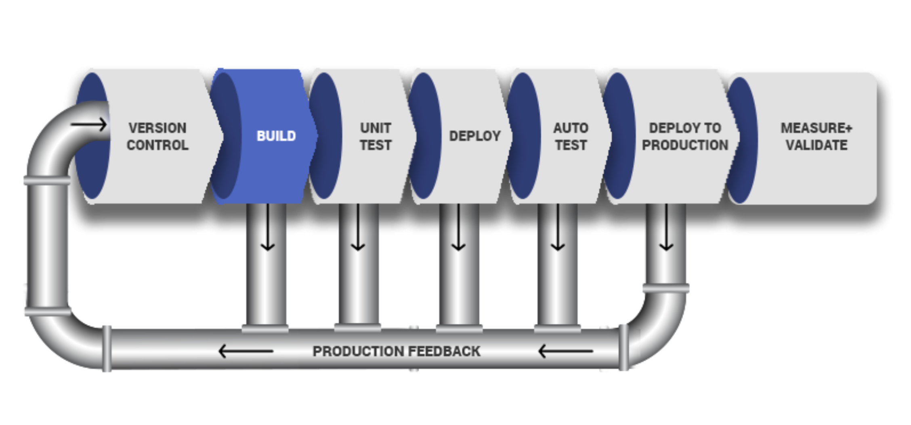

# EXPERIENCE CONTINUOUS INTEGRATION WITH JENKINS | ANSIBLE | ARTIFACTORY | SONARQUBE | PHP

IMPORTANT NOTICE – This project has some initial theoretical concepts that must be well understood before moving on to the practical part. Please read it carefully as many times as needed to completely digest the most important and fundamental DevOps concepts. To successfully implement this project, it is crucial to grasp the importance of the entire CI/CD process, roles of each tool and success metrics – so we encourage you to thoroughly study the following theory until you feel comfortable explaining all the concepts (e.g., to your new junior colleague or during a job interview).
In previous projects, you have been deploying a tooling website directly into the MARKDOWN_HASH40d1b2d83998fabacb726e5bc3d22129MARKDOWNHASH directory on dev servers. Well, even though that worked fine, and we were able to access the website, it is not the best way to do it. Real world web application code written on [Java](https://en.wikipedia.org/wiki/Java(programming_language)), .NET or other compiled programming languages require a build stage to create an executable file. The executable file (e.g., jar file in case of Java) contains all the codes embedded, and the necessary library dependencies, which the application needs to run and work successfully.
Some other programs written languages such as PHP, JavaScript or Python work directly without being built into an executable file – these languages are called interpreted. That is why we could easily deploy the entire code from git into var/www/html and immediately the webserver was able to render the pages in a browser. However, it is not optimal to download code directly from Git onto our servers. There is a smarter way to package the entire application code, and track release versions. We can package the entire code and all its dependencies into an archive such as .tar.gz or .zip, so that it can be easily unpacked on a respective environment’s servers.
For a better understanding of the difference between compiled vs interpreted programming languages – read this short article.
In this project, you will understand and get hands on experience around the entire concept around CI/CD from applications perspective. To fully gain real expertise around this idea, it is best to see it in action across different programming languages and from the platform perspective too. From the application perspective, we will be focusing on PHP here; there are more projects ahead that are based on Java, Node.js, .Net and Python. By the time you start working on Terraform, Docker and Kubernetes projects, you will get to see the platform perspective of CI/CD in action.


## What is Continuous Integration?
In software engineering, Continuous Integration (CI) is a practice of merging all developers’ working copies to a shared mainline (e.g., Git Repository or some other version control system) several times per day. Frequent merges reduce chances of any conflicts in code and allow to run tests more often to avoid massive rework if something goes wrong. This principle can be formulated as Commit early, push often.
The general idea behind multiple commits is to avoid what is generally considered as Merge Hell or Integration hell. When a new developer joins a new project, he or she must create a copy of the main codebase by starting a new feature branch from the mainline to develop his own features (in some organization or team, this could be called a develop, main or master branch). If there are tens of developers working on the same project, they will all have their own branches created from mainline at different points in time. Once they make a copy of the repository it starts drifting away from the mainline with every new merge of other developers’ codes. If this lingers on for a very long time without reconciling the code, then this will cause a lot of code conflict or Merge Hell, as rightly said. Imagine such a hell from tens of developers or worse, hundreds. So, the best thing to do, is to continuously commit & push your code to the mainline. As many times as tens times per day. With this practice, you can avoid Merge Hell or Integration hell.
CI concept is not only about committing your code. There is a general workflow, let us start it…

- Run tests locally: Before developers commit their code to a central repository, it is recommended to test the code locally. So, Test-Driven Development (TDD) approach is commonly used in combination with CI. Developers write tests for their code called unit-tests, and before they commit their work, they run their tests locally. This practice helps a team to avoid having one developer’s work-in-progress code from breaking other developers’ copy of the codebase.
- Compile code in CI: After testing codes locally, developers commit and push their work to a central repository. Rather than building the code into an executable locally, a dedicated CI server picks up the code and runs the build there. In this project we will use, already familiar to you, Jenkins as our CI server. Build happens either periodically – by polling the repository at some configured schedule, or after every commit. Having a CI server where builds run is a good practice for a team, as everyone has visibility into each commit and its corresponding builds.
- Run further tests in CI: Even though tests have been run locally by developers, it is important to run the unit-tests on the CI server as well. But, rather than focusing solely on unit-tests, there are other kinds of tests and code analysis that can be run using CI server. These are extremely critical to determining the overall quality of code being developed, how it interacts with other developers’ work, and how vulnerable it is to attacks. A CI server can use different tools for Static Code Analysis, Code Coverage Analysis, Code smells Analysis, and Compliance Analysis. In addition, it can run other types of tests such as Integration and Penetration tests. Other tasks performed by a CI server include production of code documentation from the source code and facilitate manual quality assurance (QA) testing processes.
- Deploy an artifact from CI: At this stage, the difference between CI and CD is spelt out. As you now know, CI is Continuous Integration, which is everything we have been discussing so far. CD on the other hand is Continuous Delivery which ensures that software checked into the mainline is always ready to be deployed to users. The deployment here is manually triggered after certain QA tasks are passed successfully. There is another CD known as Continuous Deployment which is also about deploying the software to the users, but rather than manual, it makes the entire process fully automated. Thus, Continuous Deployment is just one step ahead in automation than Continuous Delivery.
Continuous Integration in The Real World
To emphasize a typical CI Pipeline further, let us explore the diagram below a little deeper.



- Version Control: This is the stage where developers’ code gets committed and pushed after they have tested their work locally.
- Build: Depending on the type of language or technology used, we may need to build the codes into binary executable files (in case of compiled languages) or just package the codes together with all necessary dependencies into a deployable package (in case of interpreted languages).
- Unit Test: Unit tests that have been developed by the developers are tested. Depending on how the CI job is configured, the entire pipeline may fail if part of the tests fails, and developers will have to fix this failure before starting the pipeline again. A Job by the way, is a phase in the pipeline. Unit Test is a phase, therefore it can be considered a job on its own.
Deploy: Once the tests are passed, the next phase is to deploy the compiled or packaged code into an artifact repository. This is where all the various versions of code including the latest will be stored. The CI tool will have to pick up the code from this location to proceed with the remaining parts of the pipeline.
- Auto Test: Apart from Unit testing, there are many other kinds of tests that are required to analyse the quality of code and determine how vulnerable the software will be to external or internal attacks. These tests must be automated, and there can be multiple environments created to fulfil different test requirements. For example, a server dedicated for Integration Testing will have the code deployed there to conduct integration tests. Once that passes, there can be other sub-layers in the testing phase in which the code will be deployed to, so as to conduct further tests. Such are User Acceptance Testing (UAT), and another can be Penetration Testing. These servers will be named according to what they have been designed to do in those environments. A UAT server is generally be used for UAT, SIT server is for Systems Integration Testing, PEN Server is for Penetration Testing and they can be named whatever the naming style or convention in which the team is used. An environment does not necessarily have to reside on one single server. In most cases it might be a stack as you have defined in your Ansible Inventory. All the servers in the inventory/dev are considered as Dev Environment. The same goes for inventory/stage (Staging Environment) inventory/preprod (Pre-production environment), inventory/prod (Production environment), etc. So, it is all down to naming convention as agreed and used company or team wide.
- Deploy to production: Once all the tests have been conducted and either the release manager or whoever has the authority to authorize the release to the production server is happy, he gives green light to hit the deploy button to ship the release to production environment. This is an Ideal Continuous Delivery Pipeline. If the entire pipeline was automated and no human is required to manually give the Go decision, then this would be considered as Continuous Deployment. Because the cycle will be repeated, and every time there is a code commit and push, it causes the pipeline to trigger, and the loop continues over and over again.
- Measure and Validate: This is where live users are interacting with the application and feedback is being collected for further improvements and bug fixes. There are many metrics that must be determined and observed here. We will quickly go through 13 metrics that MUST be considered.


## Common Best Practices of CI/CD

Before we move on to observability metrics – let us list down the principles that define a reliable and robust CI/CD pipeline:

- Maintain a code repository
- Automate build process
- Make builds self-tested
- Everyone commits to the baseline every day
- Every commit to baseline should be built
- Every bug-fix commit should come with a test case
- Keep the build fast
- Test in a clone of production environment
- Make it easy to get the latest deliverables
- Everyone can see the results of the latest build
- Automate deployment (if you are confident enough in your CI/CD pipeline and willing to go for a fully automated Continuous Deployment)


## WHY ARE WE DOING EVERYTHING WE ARE DOING? – 13 DEVOPS SUCCESS METRICS

After all, DevOps is all about continuous delivery or deployment, and being able to ship out quality code as fast as possible. This is a very ambitious thing to desire; therefore, we must be careful not to break things as we are moving very fast. By tracking these metrics, we can determine our delivery speed and bottlenecks before breaking things. Ultimately, the goals of DevOps are enhanced Velocity, Quality, and Performance. But how do we track these parameters? Let us have a look at the 13 metrics to watch out for.

1. Deployment frequency: Tracking how often you do deployments is a good DevOps metric. Ultimately, the goal is to do more smaller deployments as often as possible. Reducing the size of deployments makes it easier to test and release. I would suggest counting both production and non-production deployments separately. How often you deploy to QA or pre-production environments is also important. You need to deploy early and often in QA to ensure enough time for testing.
2. Lead time: If the goal is to ship code quickly, this is a key DevOps metric. I would define lead time as the amount of time that occurs between starting on a work item until it is deployed. This helps you know that if you started on a new work item today, how long would it take on average until it gets to production.
3. Customer tickets: The best and worst indicator of application problems is customer support tickets and feedback. The last thing you want is your users reporting bugs or having problems with your software. Because of this, customer tickets also serve as a good indicator of application quality and performance problems.
4. Percentage of passed automated tests: To increase velocity, it is highly recommended that the development team makes extensive usage of unit and functional testing. Since DevOps relies heavily on automation, tracking how well automated tests work is a good DevOps metrics. It is good to know how often code changes break tests.
5. Defect escape rate: Do you know how many software defects are being found in production versus QA? If you want to ship code fast, you need to have confidence that you can find software defects before they get to production. Defect escape rate is a great DevOps metric to track how often those defects make it to production.
6. Availability: The last thing we ever want is for our application to be down. Depending on the type of application and how we deploy it, we may have a little downtime as part of scheduled maintenance. It is highly recommended to track this metric and all unplanned outages. Most software companies build status pages to track this. Such as this Google Products Status Page
7. Service level agreements: Most companies have some service level agreement (SLA) that they promise to the customers. It is also important to track compliance with SLAs. Even if there are no formally stated SLAs, there probably are application non-functional requirements or expectations to be met.
8. Failed deployments: We all hope this never happens, but how often do our deployments cause an outage or major issues for the users? Reversing a failed deployment is something we never want to do, but it is something you should always plan for. If you have issues with failed deployments, be sure to track this metric over time. This could also be seen as tracking *Mean Time To Failure (MTTF).
9. Error rates: Tracking error rates within the application is super important. Not only they serve as an indicator of quality problems, but also ongoing performance and uptime related issues. In software development, errors are also known as exceptions, and proper exception handling is critical. If they are not handled nicely, we can figure it out while monitoring the rate of errors.
     - Bugs – Identify new exceptions being thrown in the code after a deployment
     - Production issues – Capture issues with database connections, query timeouts, and other related issues
     
     Presenting error rate metrics like this simply gives greater insights into where to focus attention.

10. Application usage & traffic: After a deployment, we want to see if the number of transactions or users accessing our system looks normal. If we suddenly have no traffic or a giant spike in traffic, something could be wrong. An attacker may be routing traffic elsewhere, or initiating a DDOS attack
11. Application performance: Before we even perform a deployment, we should configure monitoring tools like Retrace, DataDog, New Relic, or AppDynamics to look for performance problems, hidden errors, and other issues. During and after the deployment, we should also look for any changes in overall application performance and establish some benchmarks to know when things deviate from the norm.
It might be common after a deployment to see major changes in the usage of specific SQL queries, web service or HTTP calls, and other application dependencies. These monitoring tools can provide valuable visualizations like this one below that helps make it easy to spot problems.

12. Mean time to detection (MTTD): When problems happen, it is important that we identify them quickly. The last thing we want is to have a major partial or complete system outage and not know about it. Having robust application monitoring and good observability tools in place will help us detect issues quickly. Once they are detected, we also must fix them quickly!
13. Mean time to recovery (MTTR): This metric helps us track how long it takes to recover from failures. A key metric for the business is keeping failures to a minimum and being able to recover from them quickly. It is typically measured in hours and may refer to business hours, not calendar hours.

These are the major metrics that any DevOps team should track and monitor to understand how well CI/CD process is established and how it helps to deliver quality application to the users.


## SIMULATING A TYPICAL CI/CD PIPELINE FOR A PHP BASED APPLICATION
As part of the ongoing infrastructure development with Ansible started from Project 11, you will be tasked to create a pipeline that simulates continuous integration and delivery. Target end to end CI/CD pipeline is represented by the diagram below. It is important to know that both Tooling and TODO Web Applications are based on an interpreted (scripting) language (PHP). It means, it can be deployed directly onto a server and will work without compiling the code to a machine language.

The problem with that approach is, it would be difficult to package and version the software for different releases. And so, in this project, we will be using a different approach for releases, rather than downloading directly from git, we will be using Ansible uri module.


### Set Up
This project is partly a continuation of your Ansible work, so simply add and subtract based on the new setup in this project. It will require a lot of servers to simulate all the different environments from dev/ci all the way to production. This will be quite a lot of servers altogether (But you don’t have to create them all at once. Only create servers required for an environment you are working with at the moment. For example, when doing deployments for development, do not create servers for integration, pentest, or production yet).
Try to utilize your AWS free tier as much as you can, you can also register a new account if you have exhausted the current one. Alternatively, you can use Google Cloud (GCP) to rent virtual machines from this cloud service provider – you can get $300 credit here or here (NOTE: Please read instructions carefully to get your credits)
NOTE: This is still NOT a cloud-focus project yet. AWS cloud end to end project begins from project-15. Therefore, do not worry about advanced AWS or GCP configuration. All we need here is virtual machines that can be accessed over SSH.
To minimize the cost of cloud servers, you don not have to create all the servers at once, simply spin up a minimal server set up as you progress through the project implementation and have reached a need for more.
To get started, we will focus on these environments initially.

- Ci
- Dev
- Pentest

Both SIT – For System Integration Testing and UAT – User Acceptance Testing do not require a lot of extra installation or configuration. 
They are basically the webservers holding our applications. But Pentest – For Penetration testing is where we will conduct security related tests, so some other tools and specific configurations will be needed. In some cases, it will also be used for Performance and Load testing. Otherwise, that can also be a separate environment on its own. It all depends on decisions made by the company and the team running the show.
What we want to achieve, is having Nginx to serve as a reverse proxy for our sites and tools. Each environment setup is represented in the below table and diagrams.


## CI-Environment


### Other Environments from Lower To Higher


| Server   | Domain    | a       |
| ---    | ---   | ---     |
| Jenkins | https://ci.infradev.darey.io |
|Sonarqube | https://sonar.infradev.darey.io | 


| Server   | Domain |        |
| ---    | ---   | ---     |
| Artifactory | https://artifacts.infradev.darey.io |
| Production Tooling | https://tooling.darey.io |
| Pre-Prod Tooling | https://tooling.preprod.darey.io |
| Pentest Tooling | https://tooling.pentest.darey.io |
| UAT Tooling | https://tooling.uat.darey.io |
| SIT Tooling | https://tooling.sit.darey.io |
| Dev Tooling | https://tooling.dev.darey.io |
| Production TODO-WebApp | https://todo.darey.io |
| Pre-Prod TODO-WebApp | https://todo.preprod.darey.io |
| Pentest TODO-WebApp | https://todo.pentest.darey.io |
| UAT TODO-WebApp | https://todo.uat.darey.io |
| SIT TODO-WebApp | https://todo.sit.darey.io |
| Dev TODO-WebApp | https://todo.dev.darey.io |


Ansible Inventory should look like this: 

├── ci
├── dev
├── pentest
├── pre-prod
├── prod
├── sit
└── uat

ci inventory file
```
[jenkins]
<Jenkins-Private-IP-Address>


[nginx]
<Nginx-Private-IP-Address>


[sonarqube]
<SonarQube-Private-IP-Address>


[artifact_repository]
<Artifact_repository-Private-IP-Address>
```

dev Inventory file
```
[tooling]
<Tooling-Web-Server-Private-IP-Address>


[todo]
<Todo-Web-Server-Private-IP-Address>


[nginx]
<Nginx-Private-IP-Address>


[db:vars]
ansible_user=ec2-user
ansible_python_interpreter=/usr/bin/python


[db]
<DB-Server-Private-IP-Address>
```


pentest inventory file

```
[pentest:children]
pentest-todo
pentest-tooling


[pentest-todo]
<Pentest-for-Todo-Private-IP-Address>


[pentest-tooling]
<Pentest-for-Tooling-Private-IP-Address>
```


### Observations:


1. You will notice that in the pentest inventory file, we have introduced a new concept pentest:children This is because, we want to have a group called pentest which covers Ansible execution against both pentest-todo and pentest-tooling simultaneously. But at the same time, we want the flexibility to run specific Ansible tasks against an individual group.

2. The db group has a slightly different configuration. It uses a RedHat/Centos Linux distro. Others are based on Ubuntu (in this case user is ubuntu). Therefore, the user required for connectivity and path to python interpreter are different. If all your environment is based on Ubuntu, you may not need this kind of set up. Totally up to you how you want to do this. Whatever works for you is absolutely fine in this scenario.

This makes us to introduce another Ansible concept called group_vars. With group vars, we can declare and set variables for each group of servers created in the inventory file.
For example, If there are variables we need to be common between both pentest-todo and pentest-tooling, rather than setting these variables in many places, we can simply use the group_vars for pentest. Since in the inventory file it has been created as pentest:children Ansible recognizes this and simply applies that variable to both children.


### ANSIBLE ROLES FOR CI ENVIRONMENT
Now go ahead and Add two more roles to ansible:
1. SonarQube (Scroll down to the Sonarqube section to see instructions on how to set up and configure SonarQube manually)
2. Artifactory

#### Why do we need SonarQube?
SonarQube is an open-source platform developed by SonarSource for continuous inspection of code quality, it is used to perform automatic reviews with static analysis of code to detect bugs, code smells, and security vulnerabilities. Watch a short description here. There is a lot more hands on work ahead with SonarQube and Jenkins. So, the purpose of SonarQube will be clearer to you very soon.

#### Why do we need Artifactory?
Artifactory is a product by JFrog that serves as a binary repository manager. The binary repository is a natural extension to the source code repository, in that the outcome of your build process is stored. It can be used for certain other automation, but we will it strictly to manage our build artifacts.

Watch a short description here Focus more on the first 10.08 mins

#### Configuring Ansible For Jenkins Deployment
In previous projects, you have been launching Ansible commands manually from a CLI. Now, with Jenkins, we will start running Ansible from Jenkins UI.
To do this,
1. Navigate to Jenkins URL
2. Install & Open Blue Ocean Jenkins Plugin
3. create a new pipeline 

4. Select GitHub

5. Connect Jenkins with GitHub


6. Login to GitHub & Generate an Access Tokenhttps://www.darey.io/wp-content/uploads/2021/07/Jenkins-Create-Access-Token-To-Github.png


7. Copy Access Token

8. Paste the token and connect

9. Create a new Pipeline
At this point you may not have a Jenkinsfile in the Ansible repository, so Blue Ocean will attempt to give you some guidance to create one. But we do not need that. We will rather create one ourselves. So, click on Administration to exit the Blue Ocean console.


Here is our newly created pipeline. It takes the name of your GitHub repository.


Let us create our Jenkinsfile

Inside the Ansible project, create a new directory deploy and start a new file Jenkinsfile inside the directory.

Add the code snippet below to start building the Jenkinsfile gradually. This pipeline currently has just one stage called Build and the only thing we are doing is using the shell script module to echo Building Stage
```
pipeline {
    agent any


  stages {
    stage('Build') {
      steps {
        script {
          sh 'echo "Building Stage"'
        }
      }
    }
    }
}
```

Now push the code added to github


Now go back into the Ansible pipeline in Jenkins, and select configure


Back to the pipeline again, this time click "Build now"

This will trigger a build and you will be able to see the effect of our basic Jenkinsfile configuration by going through the console output of the build.


This will trigger a build and you will be able to see the effect of our basic Jenkinsfile configuration by going through the console output of the build.
To really appreciate and feel the difference of Cloud Blue UI, it is recommended to try triggering the build again from Blue Ocean interface.
1. Click on Blue Ocean

2. Select your project

3. Click on the play button against the branch


Notice that this pipeline is a multibranch one. This means, if there were more than one branch in GitHub, Jenkins would have scanned the repository to discover them all and we would have been able to trigger a build for each branch.
Let us see this in action.


1. Create a new git branch and name it `feature/jenkinspipeline-stages`

2. Currently we only have the Build stage. Let us add another stage called Test. Paste the code snippet below and push the new changes to GitHub.


```
   pipeline {
    agent any


  stages {
    stage('Build') {
      steps {
        script {
          sh 'echo "Building Stage"'
        }
      }
    }


    stage('Test') {
      steps {
        script {
          sh 'echo "Testing Stage"'
        }
      }
    }
    }
}
```