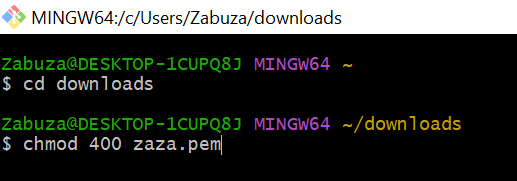
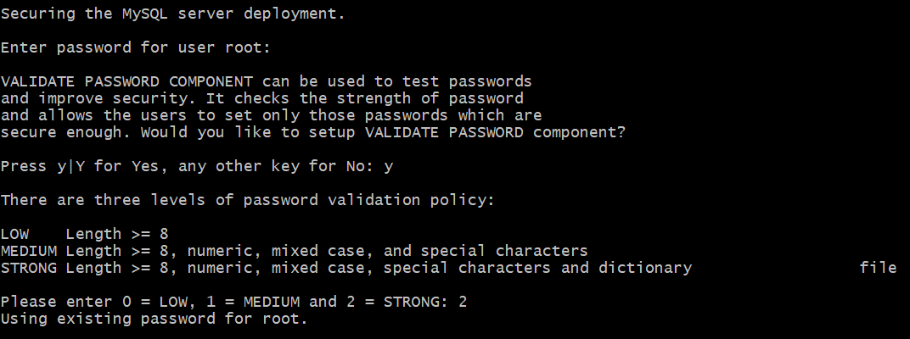

# WEB STACK IMPLEMENTATION (LAMP STACK)

## LAMP (Linux, Apache, MySQL, PHP or Python, or Perl)
### Setup our instance
- We need an AWS account 
- launch a new EC2 instance of t2.micro family with Ubuntu Server 20.04 LTS
- Private key (.PEM file) should be saved securely and spin up the instance


- Connecting to EC2 terminal
  - Using the terminal on MAC/Linux
  - Using Windows Terminal
  - We'll be connecting to the EC2 instance using Gitbash terminal installed in my windows system


    - We'll be needing our saved PEM key file change directory to download folder

    

    - Run this command to ensure your key is not publicly viewable.

`chmod 400 <your-PEM-file-name>.pem`



- I'll be using the ssh protocol to connect my local terminal to my EC2 server

`ssh -i <private-key-name>. pem ubuntu@<Public-IP-address>`


 - Type `yes` to connect

      

    - Now we are connected to our instance well done🎉.


We have created our first Linux Server in the Cloud and our set up looks like this now: (we are the client)


### STEP 1
#### Installing Apache and updating the firewall

Update a list of packages in package manager:

`sudo apt update`

Run apache2 package installation:

`sudo apt install apache2`

To verify that apache2 is running as a Service in our OS, use following command:

`sudo systemctl status apache2`

If it is green and running, then you did everything correctly – you have just launched your first Web Server in the Clouds!


Now let us check if our server is running and we can access it locally and from the Internet

let us try to check how we can access it locally in our Ubuntu shell, run:

`curl http://localhost:80`


Now it is time for us to test how our Apache HTTP server can respond to requests from the Internet. Open a web browser of your choice and try to access following url
`http://<Public-IP-Address>:80`


looks like this:

  
It works


### STEP 2
#### Installing MYSQL

- Use ‘apt’ to acquire and install this software:

`sudo apt install mysql-server`

  When prompted, confirm installation by typing Y, and then ENTER.

- When the installation is finished, log in to the MySQL console by typing:

`sudo mysql` 


 


- It’s recommended that you run a security script that comes pre-installed with MySQL. This script will remove some insecure default settings and lock down access to your database system. Before running the script, you will set a password for the root user, using mysql_native_password as default authentication method. We’re defining this user’s password as PassWord.1

`ALTER USER 'root'@'localhost' IDENTIFIED WITH mysql_native_password BY 'PassWord.1';`


- Exit the MySQL shell with:

`mysql> exit`  


    

- Start the interactive script by running:

`sudo mysql_secure_installation`

  - Answer Y for yes, or anything else to continue without enabling.
  
  

  Press y|Y for Yes, any other key for No:

If you answer “yes”, you’ll be asked to select a level of password validation. Keep in mind that if you enter 2 for the strongest level, you will receive errors when attempting to set any password which does not contain numbers, upper and lowercase letters, and special characters, or which is based on common dictionary words e.g., PassWord.1


      For the rest of the questions, press Y and hit the ENTER key at each prompt. This will prompt you to change the root password, remove some anonymous users and the test database, disable remote root logins, and load these new rules so that MySQL immediately respects the changes you have made.

- Now log in to the MySQL console by typing:

`sudo mysql -p`


- Exit the MySQL shell with:

`mysql> exit`  


#### Your MySQL server is now installed and secured. Next, we will install PHP, the final component in the LAMP stack.

### STEP 3  INSTALLING PHP

We have Apache installed to serve our content and MySQL installed to store and manage our data. PHP is the component of our setup that will process code to display dynamic content to the end user. In addition to the php package, you’ll need php-mysql, a PHP module that allows PHP to communicate with MySQL-based databases. You’ll also need libapache2-mod-php to enable Apache to handle PHP files. Core PHP packages will automatically be installed as dependencies.

- To install these 3 packages at once, run:

`sudo apt install php libapache2-mod-php php-mysql`


- Once the installation is finished, you can run the following command to confirm your PHP version:

`php -v`


At this point, our LAMP stack is completely installed and fully operational.

· Linux (Ubuntu)

· Apache HTTP Server

· MySQL

· PHP 

### STEP 4  CREATING A VIRTUAL HOST FOR YOUR WEBSITE USING APACHE

- Create the directory for projectlamp using ‘mkdir’ command as follows:

`sudo mkdir /var/www/projectlamp`

- Next, assign ownership of the directory with our current system user:

`sudo chown -R $USER:$USER /var/www/projectlamp`

- Then, create and open a new configuration file in Apache’s sites-available directory using your preferred command-line editor.

`sudo nano /etc/apache2/sites-available/projectlamp.conf`

  


  This will create a new blank file. Paste in the following configuration text:
```
<VirtualHost *:80>

ServerName projectlamp

ServerAlias www.projectlamp

ServerAdmin webmaster@localhost

DocumentRoot /var/www/projectlamp

ErrorLog ${APACHE_LOG_DIR}/error.log

CustomLog ${APACHE_LOG_DIR}/access.log combined

</VirtualHost>
```     
- right click and paste
- press ctrl + x to exit
- Type Yes and Enter


- press Enter


- We can use the ls command to show the new file in the sites-available directory

`sudo ls /etc/apache2/sites-available`

   You will see something like this;


- We can now use a2ensite command to enable the new virtual host:

`sudo a2ensite projectlamp`

- You might want to disable the default website that comes installed with Apache. This is required if you’re not using a custom domain name, because in this case Apache’s default configuration would overwrite your virtual host. To disable Apache’s default website use a2dissite command, type:

`sudo a2dissite 000-default`

- To make sure your configuration file doesn’t contain syntax errors, run:

`sudo apache2ctl configtest`

- Finally, reload Apache so these changes take effect:

`sudo systemctl reload apache2`


- Our new website is now active, but the web root /var/www/projectlamp is still empty. Lets create an index.html file in that location so that we can test that the virtual host works as expected:

    `sudo echo 'Hello LAMP from hostname' $(curl -s http://169.254.169.254/latest/meta-data/public-hostname) 'with public IP' $(curl -s http://169.254.169.254/latest/meta-data/public-ipv4) > /var/www/projectlamp/index.html`

- Now let's go to our browser and try to open our website URL using IP address:

   `http://<EC2-Public-IP-Address>:80`


- We can also access our website in our browser by public DNS name, not only by IP. Let us try it out, the result must be the same (port is optional)

  `http://<Public-DNS-Name>:80`


- You can leave this file in place as a temporary landing page for your application until you set up an index.php file to replace it. Once you do that, remember to remove or rename the index.html file from your document root, as it would take precedence over an index.php file by default.


### STEP 5  ENABLE PHP ON THE WEBSITE

- With the default DirectoryIndex settings on Apache, a file named index.html will always take precedence over an index.php file.In case you want to change this behavior, you’ll need to edit the /etc/apache2/mods-enabled/dir.conf file and change the order in which the index.php file is listed within the DirectoryIndex directive:

  `sudo nano /etc/apache2/mods-enabled/dir.conf`

- clear everythng and paste this in:

 ```
<IfModule mod_dir.c>

#Change this:

#DirectoryIndex index.html index.cgi index.pl index.php index.xhtml index.htm

#To this:

DirectoryIndex index.php index.html index.cgi index.pl index.xhtml index.htm

</IfModule>
```

- press ctrl + x to exit
- Type Yes and Enter


- press Enter


- After saving and closing the file, you will need to reload Apache so the changes take effect:

`sudo systemctl reload apache2`


- Create a new file named index.php inside your custom web root folder:

`nano /var/www/projectlamp/index.php`

- This will open a blank file. Add the following text, which is valid PHP code, inside the file:

```
<?php

phpinfo();
```


- save and close the file, refresh the page and you will see a page similar to this:


This page provides information about your server from the perspective of PHP. It is useful for debugging and to ensure that your settings are being applied correctly.
#### If you can see this page in your browser, then congratulations🎉 your PHP installation is working as expected.

After checking the relevant information about your PHP server through that page, it’s best to remove the file you created as it contains sensitive information about your PHP environment -and your Ubuntu server. You can use rm to do so:

`sudo rm /var/www/projectlamp/index.php`

You can always recreate this page if you need to access the information again later.


## Now terminate your instance and any other resources to avoid additional charges
## CIAO!
 