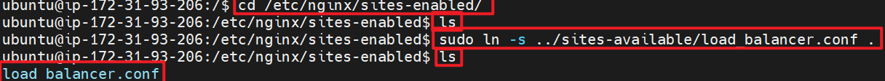
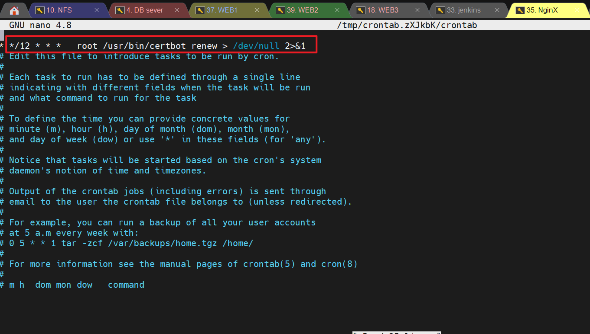

## LOAD BALANCER SOLUTION WITH NGINX AND SSL/TLS

By now you have learned what Load Balancing is used for and have configured an LB solution using Apache, but a DevOps engineer must be a versatile professional and know different alternative solutions for the same problem. That is why, in this project we will configure an [Nginx](https://www.nginx.com/) Load Balancer solution.
It is also extremely important to ensure that connections to your Web solutions are secure and information is [encrypted in transit](https://security.berkeley.edu/data-encryption-transit-guideline) – we will also cover connection over secured HTTP (HTTPS protocol), its purpose and what is required to implement it.
When data is moving between a client (browser) and a Web Server over the Internet – it passes through multiple network devices and, if the data is not encrypted, it can be relatively easy intercepted by someone who has access to the intermediate equipment. This kind of information security threat is called Man-In-The-Middle (MIMT) attack.
This threat is real – users that share sensitive information (bank details, social media access credentials, etc.) via non-secured channels, risk their data to be compromised and used by cybercriminals.
SSL and its newer version, TSL – is a security technology that protects connection from MITM attacks by creating an encrypted session between browser and Web server. Here we will refer this family of cryptographic protocols as SSL/TLS – even though SSL was replaced by TLS, the term is still being widely used.
SSL/TLS uses digital certificates to identify and validate a Website. A browser reads the certificate issued by a Certificate Authority (CA) to make sure that the website is registered in the CA so it can be trusted to establish a secured connection.
There are different types of SSL/TLS certificates – you can learn more about them here. You can also watch a tutorial on how SSL works here or an additional resource here

In this project you will register your website with LetsEnrcypt Certificate Authority, to automate certificate issuance you will use a shell client recommended by LetsEncrypt – cetrbot.


This project consists of two parts:
- Configure Nginx as a Load Balancers

- Register a new domain name and configure secured connection using SSL/TLS certificates

Your target architecture will look like this:


## CONFIGURE NGINX AS A LOAD BALANCER
You can either uninstall Apache from the existing Load Balancer server, or create a fresh installation of Linux for Nginx.

- To uninstall and use apache on the instance we just finished using recently 
run this :
```sh
sudo systemctl stop apache2
sudo apt-get remove apache2 -y
```
```sh
sudo apt-get purge apache2 -y
```
```sh
sudo apt-get autoremove -y
```
```sh
sudo apt-get clean 

```
#                                      OR
- Create an EC2 VM based on Ubuntu Server 20.04 LTS and name it Nginx LB (do not forget to open TCP port 80 for HTTP connections, also open TCP port 443 – this port is used for secured HTTPS connections)\


- Update /etc/hosts file for local DNS with Web Servers’ names (e.g. Web1 and Web2) and their local IP addresses

from  the terminal:
```sh
sudo vi /etc/hosts

```


- Install and configure Nginx as a load balancer to point traffic to the resolvable DNS names of the webservers

Update the instance and Install Nginx

```sh
sudo apt update -y
sudo apt install nginx -y
```


- Configure Nginx LB using Web Servers’ names defined in /etc/hosts
Hint: Read this [blog[(https://linuxize.com/post/how-to-edit-your-hosts-file/)] to read about /etc/host

Open the default nginx configuration file

```sh
sudo vi /etc/nginx/sites-available/load_balancer.conf

```
#insert following configuration

```sh
upstream web {
    server Web1 weight=5;
    server Web2 weight=5;
}


server {
            listen 80;
            server_name www.domain.com;
            location / {
                
                proxy_set_header X-Forwarded-For $proxy_add_x_forwarded_for;
                proxy_pass http://web;
            }
}

 
```
- edit server name and domain name
eg tobi.com www.tobi.com  


- run the following command next
we'll delete the default configuration file 
```sh
sudo rm -f /etc/nginx/sites-enabled/default
```
- will parse and validate the configuration files:
```sh
sudo nginx -t
```


- cd into this directory
```sh
cd /etc/nginx/sites-enabled/
```
- run the ls command it's empty 
- we are gonna create a symbolic link in the current directory to the configuration file `load_balancer.conf` located in the `sites-available` directory :
```sh
sudo ln -s ../sites-available/load_balancer.conf .
```


- Restart Nginx and make sure the service is up and running
```sh
sudo systemctl restart nginx
sudo systemctl status nginx
```


## REGISTER A NEW DOMAIN NAME AND CONFIGURE SECURED CONNECTION USING SSL/TLS CERTIFICATES
Let us make necessary configurations to make connections to our Tooling Web Solution secured!

- In order to get a valid SSL certificate – you need to register a new domain name, you can do it using any [Domain name registrar](https://en.wikipedia.org/wiki/Domain_name_registrar) – a company that manages reservation of domain names. The most popular ones are: Godaddy.com, Domain.com, Bluehost.com.
Register a new domain name with any registrar of your choice in any domain zone (e.g. .com, .net, .org, .edu, .info, .xyz or any other)

I'm making use of my Godaddy domain 
 - Go to route 53 on aws portal
 
 - now click create hosted zone
 
 - Add your domain name and create
 
 - copy all 4 name servers under records
 
 - paste them in your domain name setting, Under name server
 
 - Now we create a record 
 


- Assign an Elastic IP to your Nginx LB server and associate your domain name with this Elastic IP

You might have noticed, that every time you restart or stop/start your EC2 instance – you get a new public IP address. When you want to associate your domain name – it is better to have a static IP address that does not change after reboot. Elastic IP is the solution for this problem, learn how to allocate an Elastic IP and associate it with an EC2 server [on this page](https://docs.aws.amazon.com/AWSEC2/latest/UserGuide/elastic-ip-addresses-eip.html).


- Update A record in your registrar to point to Nginx LB using Elastic IP address
Learn how to associate your domain name to your Elastic IP on this [page](https://medium.com/progress-on-ios-development/connecting-an-ec2-instance-with-a-godaddy-domain-e74ff190c233).
Side Self Study: Read about different [DNS record types](https://www.cloudflare.com/learning/dns/dns-records/) and learn what they are used for.

- Check that your Web Servers can be reached from your browser using new domain name using HTTP protocol – http://<your-domain-name.com>

- Configure Nginx to recognize your new domain name
Update your load_balancer.conf with server_name www.<your-domain-name.com> instead of server_name www.domain.com

- Install [certbot](https://certbot.eff.org/) and request for an SSL/TLS certificate
Make sure [snapd](https://snapcraft.io/snapd) service is active and running
```sh
sudo systemctl status snapd
```

Install certbot

```sh
sudo snap install --classic certbot
```

Request your certificate (just follow the certbot instructions – you will need to choose which domain you want your certificate to be issued for, domain name will be looked up from load_balancer.conf file so make sure you have updated it on step 4).
```sh
sudo ln -s /snap/bin/certbot /usr/bin/certbot
```

```sh
sudo certbot --nginx
```


if it fails go to route 53 on AWS and configure a record name eg `www` like so:


Test secured access to your Web Solution by trying to reach `https://<your-domain-name.com>`

You shall be able to access your website by using HTTPS protocol (that uses TCP port 443) and see a padlock pictogram in your browser’s search string.
Click on the padlock icon and you can see the details of the certificate issued for your website.


- Set up periodical renewal of your SSL/TLS certificate
By default, LetsEncrypt certificate is valid for 90 days, so it is recommended to renew it at least every 60 days or more frequently.
You can test renewal command in dry-run mode
```sh
sudo certbot renew --dry-run
```

- Best pracice is to have a scheduled job that to run renew command periodically. Let us configure a cronjob to run the command twice a day.
To do so, lets edit the crontab file with the following command:
```sh
crontab -e
```
select `1`

Add following line:
```sh
* */12 * * *   root /usr/bin/certbot renew > /dev/null 2>&1
```

You can always change the interval of this cronjob if twice a day is too often by adjusting schedule expression.

Side Self Study: Refresh your cron configuration knowledge by watching this [video](https://youtu.be/4g1i0ylvx3A).
You can also use this handy [online cron expression editor](https://crontab.guru/).

You have just implemented an Nginx Load Balancing Web Solution with secured HTTPS connection with periodically updated SSL/TLS certificates.

## Congratulations!

