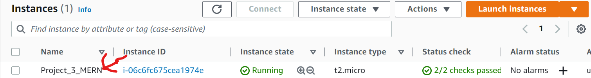
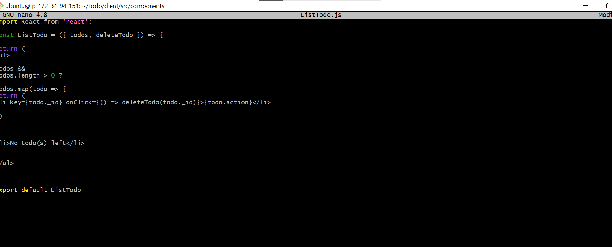
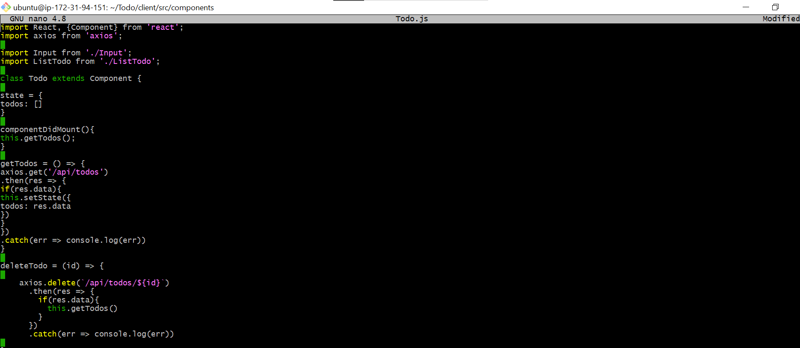

# SIMPLE TO-DO APPLICATION ON MERN WEB STACK

## Step 1

In order to complete this project, you will need an AWS account and a virtual server with Ubuntu Server OS.
When you create your EC2 Instances, you can add Tag "Name" to it with a value that corresponds to a current project you are working on – it will be reflected in the name of the EC2 Instance. Like this:




## STEP 2  BACKEND CONFIGURATION

- Update ubuntu

     `sudo apt update`

- Upgrade ubuntu

    `sudo apt upgrade`

- Let’s get the location of Node.js software from Ubuntu repositories.

    `curl -fsSL https://deb.nodesource.com/setup_18.x | sudo -E bash -`

- Install Node.js on the server:

    `sudo apt-get install -y nodejs`

- Verify the node installation with the command:

    `node -v` 

- Verify the node installation with the command:

    `npm -v` 

    

- Create a new directory for your To-Do project:

    `mkdir Todo`

- Run the command below to verify that the Todo directory is created with ls command

    `ls`

- Now change your current directory to the newly created one:

    `cd Todo`

- To initialise your project:
    `npm init`

- A new file named package.json will be created. This file will normally contain information about your application and the dependencies that it needs to run. Follow the prompts after running the command. You can press Enter several times to accept default values, then accept to write out the package.json file by typing yes.


## STEP 3 INSTALL EXPRESSJS

- install it using npm:
`npm install express`

- Now create a file index.js with the command below
`touch index.js`

- Run ls to confirm that your index.js file is successfully created
`ls`


- install the dotenv module
`npm install dotenv`
- Open the index.js file with the command below
`nano index.js`
Type the code below into it and save. Do not get overwhelmed by the code you see. For now, simply paste the code into the file.

```
const express = require('express');
require('dotenv').config();

const app = express();

const port = process.env.PORT || 5000;

app.use((req, res, next) => {
res.header("Access-Control-Allow-Origin", "\*");
res.header("Access-Control-Allow-Headers", "Origin, X-Requested-With, Content-Type, Accept");
next();
});

app.use((req, res, next) => {
res.send('Welcome to Express');
});

app.listen(port, () => {
console.log(`Server running on port ${port}`)
});
```

Notice that we have specified to use port 5000 in the code. This will be required later when we go on the browser.

- Now it is time to start our server to see if it works. Open the terminal in the same directory as your index.js file and type:
`node index.js`

If everything goes well, we should see Server running on port 5000 in our terminal.


- Now we need to open this port 5000 in EC2 Security Groups.

  - **Step 1**
    

  - **Step 2**
    

  - **Step 3**
    

  - **Step 4**
    

  - **Step 5**
    

  - **Step 6**
    


- Now let's open up our browser and try to access our server’s Public IP or Public DNS name followed by port 5000:

`http://<PublicIP-or-PublicDNS>:5000`

- Quick reminder how to get your server’s Public IP and public DNS name:

   - You can find it in your AWS web console in EC2 details:
     `curl -s http://169.254.169.254/latest/meta-data/public-ipv4` for Public IP address 

      

     `curl -s http://169.254.169.254/latest/meta-data/public-hostname` for Public DNS name.

      


On our web browser


- There are three actions that our To-Do application needs to be able to do:
    - Create a new task
    - Display list of all tasks
    - Delete a completed task

    Each task will be associated with some particular endpoint and will use different standard HTTP request methods: 
    - POST
    - GET 
    - DELETE
- For each task, we need to create routes that will define various endpoints that the To-do app will depend on. So let us create a folder routes
`mkdir routes`

- Change directory to routes folder.

`cd routes`

- Now, create a file api.js with the command below

`touch api.js`

- Open the file with the command below

`nano api.js`

Copy the code below into the nano editor :
```
const express = require ('express');
const router = express.Router();

router.get('/todos', (req, res, next) => {

});

router.post('/todos', (req, res, next) => {

});

router.delete('/todos/:id', (req, res, next) => {

})

module.exports = router;
```


## STEP 4 

since the app is going to make use of Mongodb which is a NoSQL database, we need to create a model.A schema is a blueprint of how the database will be constructed, including other data fields that may not be required to be stored in the database. These are known as virtual properties.

- To create a Schema and a model, install mongoose which is a Node.js package that makes working with mongodb easier.
    - Change directory back Todo folder with cd .. and install Mongoose
    `npm install mongoose`
    - Create a new folder models :
    `mkdir models`
    - Change the directory into the newly created ‘models’ folder with
    `cd models`

- All three commands above can be defined in one line to be executed consequently with help of && operator, like this:
`mkdir models && cd models && touch todo.js`

paste this in the nano editor todo.js file:
```
const mongoose = require('mongoose');
const Schema = mongoose.Schema;

//create schema for todo
const TodoSchema = new Schema({
action: {
type: String,
required: [true, 'The todo text field is required']
}
})

//create model for todo
const Todo = mongoose.model('todo', TodoSchema);

module.exports = Todo;
```

- Now we need to update our routes from the file api.js in ‘routes’ directory to make use of the new model.
  `cd ~`
  - cd to Routes directory, open api.js with: 
    `nano api.js`
  - delete the code inside and paste these code below into it then save and exit:
   
```
const express = require ('express');
const router = express.Router();
const Todo = require('../models/todo');
 
router.get('/todos', (req, res, next) => {
 
//this will return all the data, exposing only the id and action field to the client
Todo.find({}, 'action')
.then(data => res.json(data))
.catch(next)
});
 
router.post('/todos', (req, res, next) => {
if(req.body.action){
Todo.create(req.body)
.then(data => res.json(data))
.catch(next)
}else {
res.json({
error: "The input field is empty"
})
}
});
 
router.delete('/todos/:id', (req, res, next) => {
Todo.findOneAndDelete({"_id": req.params.id})
.then(data => res.json(data))
.catch(next)
})
 
module.exports = router;
```


## STEP 5 MongoDB Database

- We need a database where we will store our data. For this, we will make use of mLab. mLab provides MongoDB database as a service solution (DBaaS), so to make life easy, you will need to sign up for shared clusters free account, which is ideal for our use case. [Sign up here](https://www.mongodb.com/atlas-signup-from-mlab). Follow the signup process, select AWS as the cloud provider, and choose a region near you.

- complete the get started quick guide 
Then we allow access to the MongoDB database from anywhere (Not secure, but it is ideal for testing)


- Create a MongoDB database and collection inside mLab


In the index.js file, we specified process.env to access environment variables, but we have not yet created this file. So we need to do that now.
- Create a file in your Todo directory and name it .env.
`cd Todo`

`touch .env`

`nano  .env`
- Add the connection string to access the database in it, just as below:
`DB = 'mongodb+srv://<username>:<password>@<network-address>/<dbname>?retryWrites=true&w=majority'`

  Ensure to update `<username>, <password>, <network-address> and <database>`according to your setup

- Here is how to get your connection string


- Now we need to update the index.js to reflect the use of .env so that Node.js can connect to the database.

`nano index.js`

delete existing content in the file, and update it with the entire code below:

```
const express = require('express');
const bodyParser = require('body-parser');
const mongoose = require('mongoose');
const routes = require('./routes/api');
const path = require('path');
require('dotenv').config();

const app = express();

const port = process.env.PORT || 5000;

//connect to the database
mongoose.connect(process.env.DB, { useNewUrlParser: true, useUnifiedTopology: true })
.then(() => console.log(`Database connected successfully`))
.catch(err => console.log(err));

//since mongoose promise is depreciated, we overide it with node's promise
mongoose.Promise = global.Promise;

app.use((req, res, next) => {
res.header("Access-Control-Allow-Origin", "\*");
res.header("Access-Control-Allow-Headers", "Origin, X-Requested-With, Content-Type, Accept");
next();
});

app.use(bodyParser.json());

app.use('/api', routes);

app.use((err, req, res, next) => {
console.log(err);
next();
});

app.listen(port, () => {
console.log(`Server running on port ${port}`)
});
```

Using environment variables to store information is considered more secure and best practice to separate configuration and secret data from the application, instead of writing connection strings directly inside the index.js application file.

- Start your server using the command:
`node index.js`

We will see a message ‘Database connected successfully’


This means we have our backend configured. Now we are going to test it.

So far we have written the backend part of our To-Do application, and configured a database, but we do not have a frontend UI yet. We need ReactJS code to achieve that. But during development, we will need a way to test our code using RESTful API. Therefore, we will need to make use of some API development client to test our code.
- In this project, we will use Postman to test our API.
Click [Install Postman](https://www.getpostman.com/downloads/) to download and install postman on your machine.
Click HERE to learn how perform [CRUD operations](https://en.wikipedia.org/wiki/Create,_read,_update_and_delete) on Postman

 - make sure your set header key `Content-Type as application/json`


- Create a GET request to your API on `http://<PublicIP-or-PublicDNS>:5000/api/todos`. This request retrieves all existing records from out To-do application (backend requests these records from the database and sends it us back as a response to GET request).


-  DELETE request to delete a task from out To-Do list.


By now you have tested backend part of our To-Do application and have made sure that it supports all three operations we wanted:
        Display a list of tasks – HTTP GET request
        Add a new task to the list – HTTP POST request
        Delete an existing task from the list – HTTP DELETE request
We have successfully created our Backend, now let go create the Frontend.


## Step 6 – Frontend creation

we will use the create-react-app command to scaffold our app.
- In the same root directory as your backend code, which is the Todo directory, run:
 `npx create-react-app client`
This will create a new folder in your Todo directory called client, where you will add all the react code.

Running a React App
- Before testing the react app, there are some dependencies that need to be installed.
  - Install concurrently. It is used to run more than one command simultaneously from the same terminal window.
    `npm install concurrently --save-dev`
  - Install nodemon. It is used to run and monitor the server. If there is any change in the server code, nodemon will restart it automatically and load the new changes.
    `npm install nodemon --save-dev`
In Todo folder open the package.json file. 
`cd Todo`
`nano package.json`

Change the highlighted part of the below screenshot and replace with the code below.


replace with:

"scripts": {
"start": "node index.js",
"start-watch": "nodemon index.js",
"dev": "concurrently \"npm run start-watch\" \"cd client && npm start\""
},


- Configure Proxy in package.json
  - Change directory to ‘client’
  `cd client`
  - Open the package.json file
  `nano package.json`
- Add the key value pair in the package.json file

  `"proxy": "http://localhost:5000",`


The whole purpose of adding the proxy configuration in number 3 above is to make it possible to access the application directly from the browser by simply calling the server url like `http://localhost:5000` rather than always including the entire path like `http://localhost:5000/api/todos`

 In order to be able to access the application from the Internet you have to open TCP port 3000 on EC2 by adding a new Security Group rule. You already know how to do it.


- Now, ensure you are inside the Todo directory, and simply do:

`npm run dev`


Your app should open and start running on `ec2 ip address:3000`


- Creating your React Components
One of the advantages of react is that it makes use of components, which are reusable and also make code modular. For our Todo app, there will be two stateful components and one stateless component.

- From your Todo directory run

`cd client`

- move to the src directory

`cd src`

- Inside your src folder create another folder called components

`mkdir components`

- Move into the components directory with

`cd components`

- Inside ‘components’ directory create three files Input.js, ListTodo.js and Todo.js.

`touch Input.js ListTodo.js Todo.js`

- Open Input.js file

`nano Input.js`

- Copy and paste the following:
```
import React, { Component } from 'react';
import axios from 'axios';

class Input extends Component {

state = {
action: ""
}

addTodo = () => {
const task = {action: this.state.action}

    if(task.action && task.action.length > 0){
      axios.post('/api/todos', task)
        .then(res => {
          if(res.data){
            this.props.getTodos();
            this.setState({action: ""})
          }
        })
        .catch(err => console.log(err))
    }else {
      console.log('input field required')
    }

}

handleChange = (e) => {
this.setState({
action: e.target.value
})
}

render() {
let { action } = this.state;
return (
<div>
<input type="text" onChange={this.handleChange} value={action} />
<button onClick={this.addTodo}>add todo</button>
</div>
)
}
}
export default Input
```

 


- Move to the src folder

`cd ..`

- Move to clients folder

`cd ..`

Install Axios

`npm install axios`

Go to the ‘components’ directory

`cd src/components`

-After that open your ListTodo.js

`nano ListTodo.js`

- Delete anything in the ListTodo.js then copy and paste the following code:
```
import React from 'react';

const ListTodo = ({ todos, deleteTodo }) => {

return (
<ul>
{
todos &&
todos.length > 0 ?
(
todos.map(todo => {
return (
<li key={todo._id} onClick={() => deleteTodo(todo._id)}>{todo.action}</li>
)
})
)
:
(
<li>No todo(s) left</li>
)
}
</ul>
)
}

export default ListTodo
```


- Then delete everything in `nano Todo.js` file paste the following code:
```
import React, {Component} from 'react';
import axios from 'axios';

import Input from './Input';
import ListTodo from './ListTodo';

class Todo extends Component {

state = {
todos: []
}

componentDidMount(){
this.getTodos();
}

getTodos = () => {
axios.get('/api/todos')
.then(res => {
if(res.data){
this.setState({
todos: res.data
})
}
})
.catch(err => console.log(err))
}

deleteTodo = (id) => {

    axios.delete(`/api/todos/${id}`)
      .then(res => {
        if(res.data){
          this.getTodos()
        }
      })
      .catch(err => console.log(err))

}

render() {
let { todos } = this.state;

    return(
      <div>
        <h1>My Todo(s)</h1>
        <Input getTodos={this.getTodos}/>
        <ListTodo todos={todos} deleteTodo={this.deleteTodo}/>
      </div>
    )

}
}

export default Todo;
```


We need to make little adjustment to our react code. Delete the logo and adjust our App.js to look like this.

- Move to the src folder

`cd ..`

- Make sure that you are in the src folder and run

`nano App.js`

- Delete what is there then copy and paste the code below into it:
```
import React from 'react';

import Todo from './components/Todo';
import './App.css';

const App = () => {
return (
<div className="App">
<Todo />
</div>
);
}

export default App;


After pasting, exit the editor.

- In the src directory open the App.css

`nano App.css`

- Delete what was there and then paste the following code into App.css:

.App {
text-align: center;
font-size: calc(10px + 2vmin);
width: 60%;
margin-left: auto;
margin-right: auto;
}

input {
height: 40px;
width: 50%;
border: none;
border-bottom: 2px #101113 solid;
background: none;
font-size: 1.5rem;
color: #787a80;
}

input:focus {
outline: none;
}

button {
width: 25%;
height: 45px;
border: none;
margin-left: 10px;
font-size: 25px;
background: #101113;
border-radius: 5px;
color: #787a80;
cursor: pointer;
}

button:focus {
outline: none;
}

ul {
list-style: none;
text-align: left;
padding: 15px;
background: #171a1f;
border-radius: 5px;
}

li {
padding: 15px;
font-size: 1.5rem;
margin-bottom: 15px;
background: #282c34;
border-radius: 5px;
overflow-wrap: break-word;
cursor: pointer;
}

@media only screen and (min-width: 300px) {
.App {
width: 80%;
}

input {
width: 100%
}

button {
width: 100%;
margin-top: 15px;
margin-left: 0;
}
}

@media only screen and (min-width: 640px) {
.App {
width: 60%;
}

input {
width: 50%;
}

button {
width: 30%;
margin-left: 10px;
margin-top: 0;
}
}
```


- In the src directory open the index.css

`nano index.css`

- Delete was there then copy and paste the code below:
```
body {
margin: 0;
padding: 0;
font-family: -apple-system, BlinkMacSystemFont, "Segoe UI", "Roboto", "Oxygen",
"Ubuntu", "Cantarell", "Fira Sans", "Droid Sans", "Helvetica Neue",
sans-serif;
-webkit-font-smoothing: antialiased;
-moz-osx-font-smoothing: grayscale;
box-sizing: border-box;
background-color: #282c34;
color: #787a80;
}

code {
font-family: source-code-pro, Menlo, Monaco, Consolas, "Courier New",
monospace;
}
```


- Go to the Todo directory

`cd ../..`

- When you are in the Todo directory run:

`npm run dev`

Assuming no errors when saving all these files, our To-Do app should be ready and fully functional with the functionality discussed earlier: creating a task, deleting a task and viewing all your tasks.


**CHEERS 🥂 WE DID IT** 


## Now terminate your instance and any other resources to avoid additional charges
