# DEPLOYING MEAN STACK TO UBUNTU EC2 INSTANCE IN AWS

**MEAN Stack is a combination of the following components:**

- MongoDB (Document database) – Stores and allows retrieval of data.
- Express (Back-end application framework) – Makes requests to Database for Reads and Writes.
- Angular (Front-end application framework) – Handles Client and Server Requests
- Node.js (JavaScript runtime environment) – Accepts requests and displays results to end user

## In this assignment, you are going to implement a simple Book Register web form using MEAN stack.

## Step 0 – Preparing prerequisites

In order to complete this project you will need an AWS account and a virtual server with Ubuntu 20.04 Server OS.

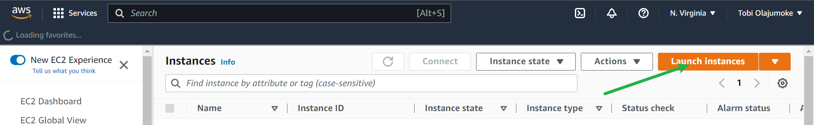

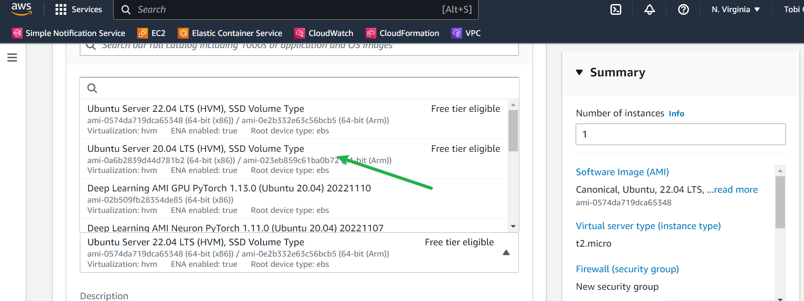

## STEP 1: Install NodeJs

### Node.js is a JavaScript runtime. Node.js is used in this tutorial to set up the Express routes and AngularJS controllers.

Install Node.js and npm from the Ubuntu repository
At the time of writing, the Node.js version included in the Ubuntu 20.04 repositories is 10.19.0 which is the previous TLS version.

- The installation is pretty straightforward. Run the following commands to update the package index and install Node.js and npm:

`sudo apt update`

`sudo apt install nodejs npm`

The command above will install a number of packages, including the tools necessary to compile and install native addons from npm.

- Once done, verify the installation by running:

`nodejs --version`

        ouput
        v10.19.0

- Installing Node.js and npm from NodeSource
NodeSource is a company focused on providing enterprise-grade Node support. It maintains an APT repository containing multiple Node.js versions. Use this repository if your application requires a specific version of Node.js.

At the time of writing, NodeSource repository provides the following versions:

- v14.x - The latest stable version.
- v13.x
- v12.x - The latest LTS version.
- v10.x - The previous LTS version.

We’ll install Node.js version 14.x:

Run the following command as a user with sudo privileges to download and execute the NodeSource installation script:

`curl -sL https://deb.nodesource.com/setup_14.x | sudo -E bash -`
 
The script will add the NodeSource signing key to your system, create an apt repository file, install all necessary packages, and refresh the apt cache.

If you need another Node.js version, for example 12.x, change the setup_14.x with setup_12.x.

Once the NodeSource repository is enabled, install Node.js and npm:

`sudo apt install nodejs`

The nodejs package contains both the node and npm binaries.

- Verify that the Node.js and npm were successfully installed by printing their versions:

`node --version`

            output
            v14.2.0Copy
            npm --version
            Copy
            6.14.4Copy

- To be able to compile native addons from npm you’ll need to install the development tools:

`sudo apt install build-essential`

Installing Node.js and npm using NVM
NVM (Node Version Manager) is a bash script that allows you to manage multiple Node.js versions on a per-user basis. With NVM you can install and uninstall any Node.js version that you want to use or test.

- Visit the nvm GitHub repository page and copy either the curl or wget command to download and install the nvm script:

`curl -o- https://raw.githubusercontent.com/nvm-sh/nvm/v0.35.3/install.sh | bash`

**Do not use sudo as it will enable nvm for the root user**

The script will clone the project’s repository from Github to the ~/.nvm directory:

- Close and reopen your terminal to start using nvm or run the following to use it now:

        output
        export NVM_DIR="$HOME/.nvm"
        [ -s "$NVM_DIR/nvm.sh" ] && \. "$NVM_DIR/nvm.sh"  # This loads nvm
        [ -s "$NVM_DIR/bash_completion" ] && \. "$NVM_DIR/bash_completion"  # This loads nvm bash_completion

As the output above says, you should either close and reopen the terminal or run the commands to add the path to nvm script to the current shell session. You can do whatever is easier for you.

- Once the script is in your PATH, verify that nvm was properly installed by typing:

`nvm --version`

        output
        0.35.3

- To get a list of all Node.js versions that can be installed with nvm, run:

`nvm list-remote`

The command will print a huge list of all available Node.js versions.

- To install the latest available version of Node.js, run:

`nvm install node`

The output should look something like this:

        output
        ...
        Checksums matched!
        Now using node v14.2.0 (npm v6.14.4)
        Creating default alias: default -> node (-> v14.2.0)

- Once the installation is completed, verify it by printing the Node.js version:

`node --version`

        v14.2.0

- Let’s install two more versions, the latest LTS version and version 10.9.0:

`nvm install --lts`

`nvm install 10.9.0`

- You can list the installed Node.js versions by typing:

`nvm ls`

- The output should look something like this:
        
        ouput
        >      v10.9.0
            v12.16.3
                v14.2.0
        default -> node (-> v14.2.0)
        node -> stable (-> v14.2.0) (default)
        stable -> 14.2 (-> v14.2.0) (default)
        iojs -> N/A (default)
        unstable -> N/A (default)
        lts/* -> lts/erbium (-> v12.16.3)
        lts/argon -> v4.9.1 (-> N/A)
        lts/boron -> v6.17.1 (-> N/A)
        lts/carbon -> v8.17.0 (-> N/A)
        lts/dubnium -> v10.20.1 (-> N/A)
        lts/erbium -> v12.16.3

The entry with an arrow on the right (> v10.9.0) is the Node.js version used in the current shell session and the default version is set to v14.2.0. Default version is the version that will be active when opening new shells.

- If you want to change the currently active version enter:

`nvm use 12.16.3`

Now using node v12.16.3 (npm v6.14.4)

- To change the default Node.js version, run the following command:

`nvm alias default 12.16.3`

## STEP 2  Install MongoDB

MongoDB stores data in flexible, JSON-like documents. Fields in a database can vary from document to document and data structure can be changed over time. For our example application, we are adding book records to MongoDB that contain book name, isbn number, author, and number of pages.

        sudo apt-key adv --keyserver hkp://keyserver.ubuntu.com:80 --recv 0C49F3730359A14518585931BC711F9BA15703C6
        echo "deb [ arch=amd64 ] https://repo.mongodb.org/apt/ubuntu trusty/mongodb-org/3.4 multiverse" | sudo tee /etc/apt/sources.list.d/mongodb-org-3.4.1 list

- Install MongoDB

`sudo apt install -y mongodb`

- Start The server

`sudo service mongodb start`

- Verify that the service is up and running

`sudo systemctl status mongodb`

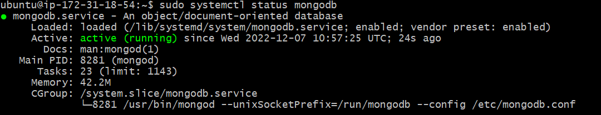

- Install body-parser package

We need ‘body-parser’ package to help us process JSON files passed in requests to the server.

`sudo npm install body-parser`

- Create a folder named ‘Books’

`mkdir Books && cd Books`

- In the Books directory, Initialize npm project

`npm init`

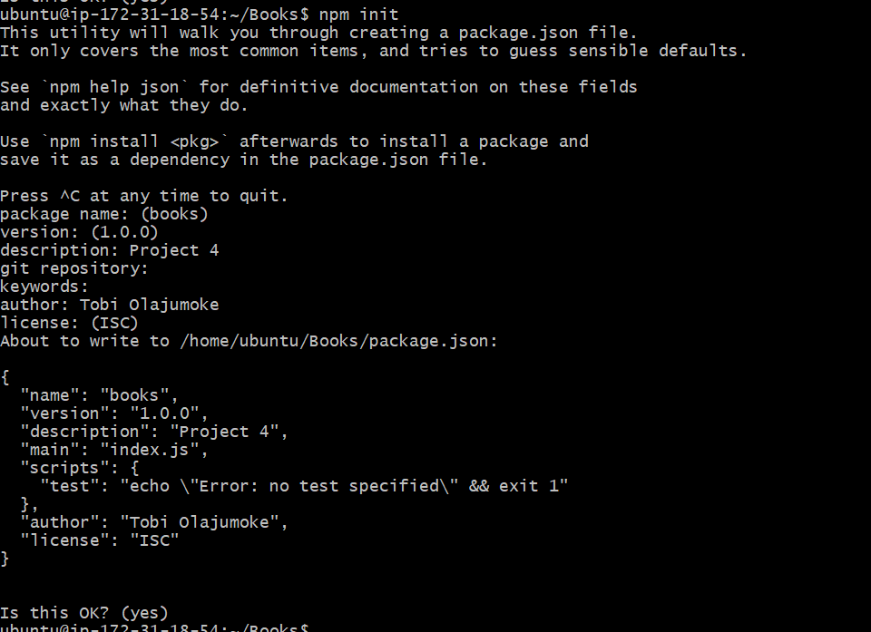
 
- Add a file to it named server.js

`nano server.js`

- Copy and paste the web server code below into the server.js file.

            var express = require('express');
            var bodyParser = require('body-parser');
            var app = express();
            app.use(express.static(__dirname + '/public'));
            app.use(bodyParser.json());
            require('./apps/routes')(app);
            app.set('port', 3300);
            app.listen(app.get('port'), function() {
                console.log('Server up: http://localhost:' + app.get('port'));
            });

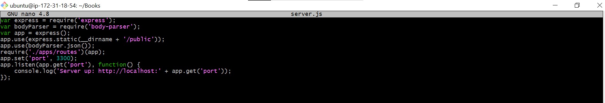

## STEP 3 INSTALL EXPRESS AND SET UP ROUTES TO THE SERVER

Express is a minimal and flexible Node.js web application framework that provides features for web and mobile applications. We will use Express to pass book information to and from our MongoDB database.
We also will use Mongoose package which provides a straightforward, schema-based solution to model your application data. We will use Mongoose to establish a schema for the database to store data of our book register.

`sudo npm install express mongoose`

- In ‘Books’ folder, create a folder named apps

`mkdir apps && cd apps`

- Create a file named routes.js

`nano routes.js`
 
 
- Copy and paste the code below into routes.js:

            var Book = require('./models/book');
            module.exports = function(app) {
            app.get('/book', function(req, res) {
                Book.find({}, function(err, result) {
                if ( err ) throw err;
                res.json(result);
                });
            }); 
            app.post('/book', function(req, res) {
                var book = new Book( {
                name:req.body.name,
                isbn:req.body.isbn,
                author:req.body.author,
                pages:req.body.pages
                });
                book.save(function(err, result) {
                if ( err ) throw err;
                res.json( {
                    message:"Successfully added book",
                    book:result
                });
                });
            });
            app.delete("/book/:isbn", function(req, res) {
                Book.findOneAndRemove(req.query, function(err, result) {
                if ( err ) throw err;
                res.json( {
                    message: "Successfully deleted the book",
                    book: result
                });
                });
            });
            var path = require('path');
            app.get('*', function(req, res) {
                res.sendfile(path.join(__dirname + '/public', 'index.html'));
            });
            };

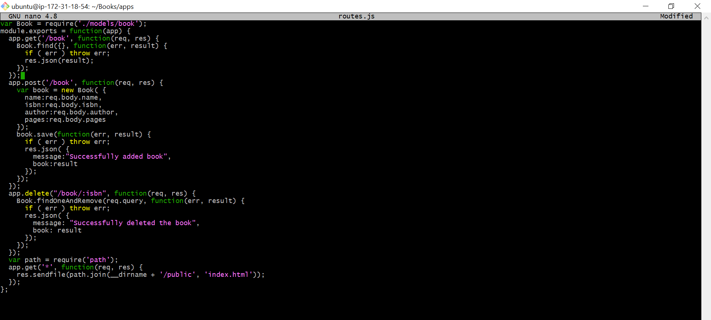

- In the ‘apps’ folder, create a folder named models

`mkdir models && cd models`

- Create a file named book.js

`nano book.js`

- Copy and paste the code below into ‘book.js’

            var mongoose = require('mongoose');
            var dbHost = 'mongodb://localhost:27017/test';
            mongoose.connect(dbHost);
            mongoose.connection;
            mongoose.set('debug', true);
            var bookSchema = mongoose.Schema( {
            name: String,
            isbn: {type: String, index: true},
            author: String,
            pages: Number
            });
            var Book = mongoose.model('Book', bookSchema);
            module.exports = mongoose.model('Book', bookSchema);

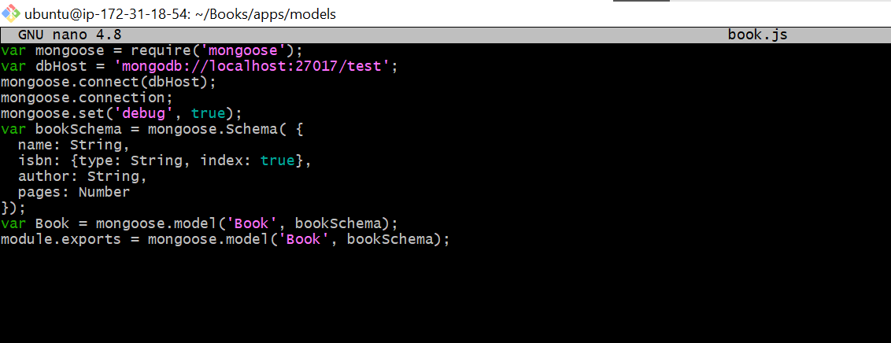

## STEP 4 Access the routes with AngularJS

AngularJS provides a web framework for creating dynamic views in your web applications. In this tutorial, we use AngularJS to connect our web page with Express and perform actions on our book register.

- Change the directory back to ‘Books’

`cd ../..`

- Create a folder named public

`mkdir public && cd public`

- Add a file named script.js

`nano script.js`

 
- Copy and paste the Code below (controller configuration defined) into the script.js file: 

                var app = angular.module('myApp', []);
                app.controller('myCtrl', function($scope, $http) {
                $http( {
                    method: 'GET',
                    url: '/book'
                }).then(function successCallback(response) {
                    $scope.books = response.data;
                }, function errorCallback(response) {
                    console.log('Error: ' + response);
                });
                $scope.del_book = function(book) {
                    $http( {
                    method: 'DELETE',
                    url: '/book/:isbn',
                    params: {'isbn': book.isbn}
                    }).then(function successCallback(response) {
                    console.log(response);
                    }, function errorCallback(response) {
                    console.log('Error: ' + response);
                    });
                };
                $scope.add_book = function() {
                    var body = '{ "name": "' + $scope.Name + 
                    '", "isbn": "' + $scope.Isbn +
                    '", "author": "' + $scope.Author + 
                    '", "pages": "' + $scope.Pages + '" }';
                    $http({
                    method: 'POST',
                    url: '/book',
                    data: body
                    }).then(function successCallback(response) {
                    console.log(response);
                    }, function errorCallback(response) {
                    console.log('Error: ' + response);
                    });
                };
                });
                In the public folder, create a file named index.html;
                vi index.html
 
 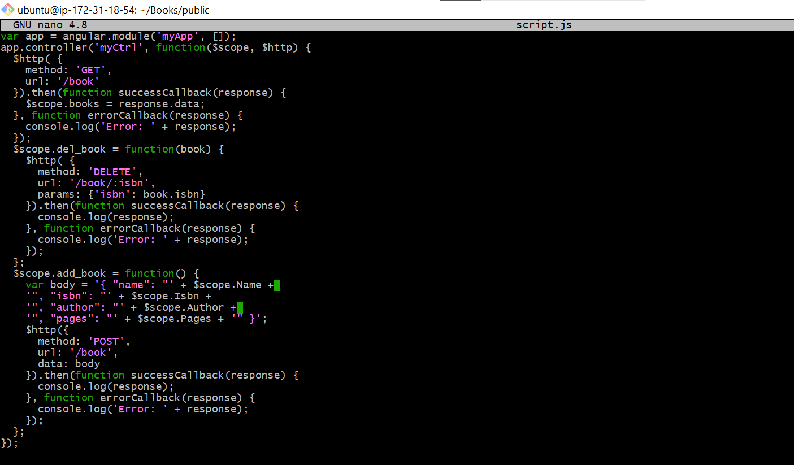
 
 
Copy and paste the code below into index.html file:

    <!doctype html>
    <html ng-app="myApp" ng-controller="myCtrl">
    <head>
        
        
    </head>
    <body>
        

        <table>
            <tr>
            <td>Name:</td>
            <td><input type="text" ng-model="Name"></td>
            </tr>
            <tr>
            <td>Isbn:</td>
            <td><input type="text" ng-model="Isbn"></td>
            </tr>
            <tr>
            <td>Author:</td>
            <td><input type="text" ng-model="Author"></td>
            </tr>
            <tr>
            <td>Pages:</td>
            <td><input type="number" ng-model="Pages"></td>
            </tr>
        </table>
        <button ng-click="add_book()">Add</button>
        

        

        

        <table>
            <tr>
            <th>Name</th>
            <th>Isbn</th>
            <th>Author</th>
            <th>Pages</th>

            </tr>
            <tr ng-repeat="book in books">
            <td>{{book.name}}</td>
            <td>{{book.isbn}}</td>
            <td>{{book.author}}</td>
            <td>{{book.pages}}</td>

            <td><input type="button" value="Delete" data-ng-click="del_book(book)"></td>
            </tr>
        </table>
        

    </body>
    </html>

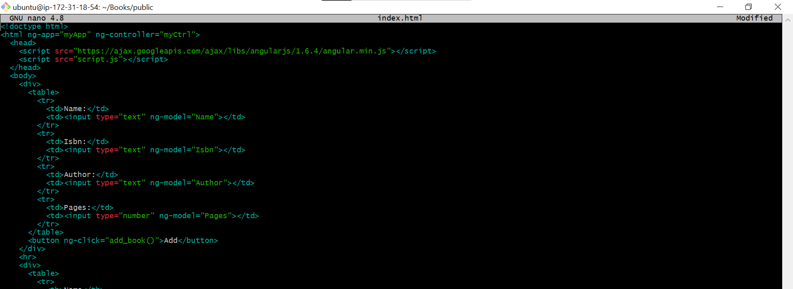

- Change the directory back up to Books

`cd ..`

- Start the server by running this command:

`node server.js`

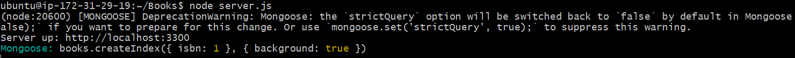

- The server is now up and running, we can connect it via port 3300. You can launch a separate Putty or SSH console to test what the curl command returns locally.

`curl -s http://localhost:3300`

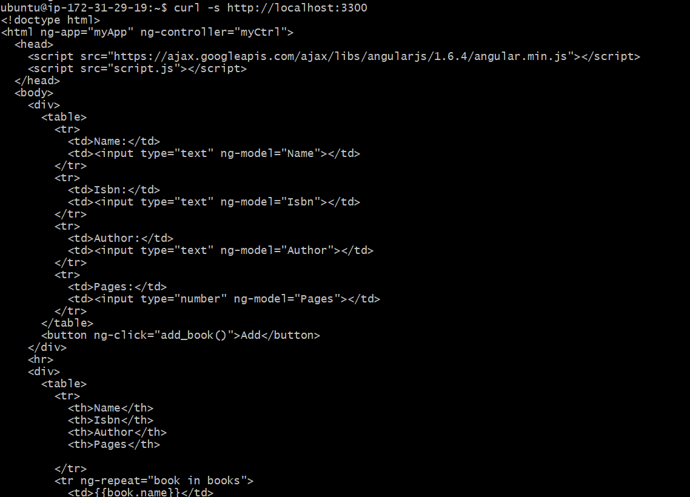

It shall return an HTML page, it is hardly readable in the CLI, but we can also try and access it from the Internet.
For this – you need to open TCP port 3300 in your AWS Web Console for your EC2 Instance.

Your security group shall look like this:

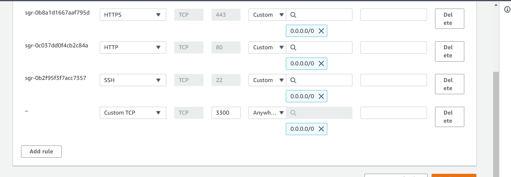

- A quick reminder on how to get your server’s Public IP and public DNS name:
You can find it in your AWS web console in EC2 details
Run:
`curl -s http://169.254.169.254/latest/meta-data/public-ipv4` for Public IP address.

or

`curl -s http://169.254.169.254/latest/meta-data/public-hostname` for Public DNS name.

This is how your WebBook Register Application will look in the browser:

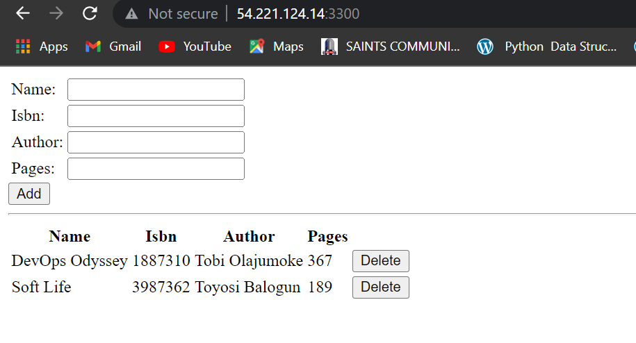

*Congratualtions mate you did it* 🍻