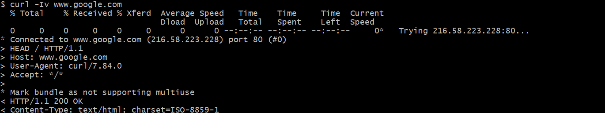
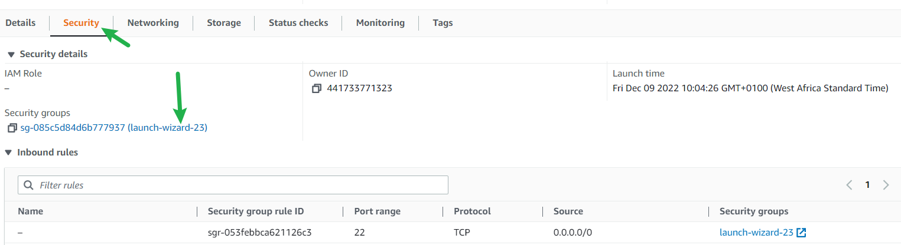

# IMPLEMENTATION OF A CLIENT SERVER ARCHITECTURE USING MYSQL DATABASE MANAGEMENT SYSTEM (DBMS). 

## CLIENT-SERVER ARCHITECTURE WITH MYSQL
Understanding Client-Server Architecture
As you proceed with your journey into the world of IT, you will begin to realise that certain concepts apply to many other areas. One of such concepts is – [Client-Server architecture](https://en.wikipedia.org/wiki/Client%E2%80%93server_model).
Client-Server refers to an architecture in which two or more computers are connected together over a network to send and receive requests between one another.
In their communication, each machine has its own role: the machine sending requests is usually referred as "Client" and the machine responding (serving) is called "Server".
A simple diagram of Web Client-Server architecture is presented below:

In the example above, a machine that is trying to access a Web site using a Web browser or simply ‘curl’ command is a client and it sends HTTP requests to a Web server (Apache, Nginx, IIS or any other) over the Internet.
If we extend this concept further and add a Database Server to our architecture, we can get this picture:

In this case, our Web Server has a role of a "Client" that connects and reads/writes to/from a Database (DB) Server (MySQL, MongoDB, Oracle, SQL Server or any other), and the communication between them happens over a Local Network (it can also be an Internet connection, but it is a common practice to place Web Server and DB Server close to each other in a local network).
The setup on the diagram above is a typical generic Web Stack architecture that you have already implemented in previous projects (LAMP, LEMP, MEAN, MERN), this architecture can be implemented with many other technologies – various Web and DB servers, from small Single-page applications SPA to large and complex portals.

This LAMP website server(s) can be located anywhere in the world and you can reach it also from any part of the globe over global network- Internet.
Assuming that you go on your browser, and typed in there www.propitixhomes.com. It means that your browser is considered the "Client". Essentially, it is sending requests to the remote server, and in turn, would be expecting some kind of response from the remote server.
Let’s take a very quick example and see Client-Server communicatation in action.
Open up your Ubuntu or Windows terminal and run the curl command:

 `curl -Iv www.google.com`

Note: If your Ubuntu does not have ‘curl’, you can install it by running `sudo apt install curl`
In this example, your terminal will be the client, while www.google.com will be the server.

See the response from the remote server in the below output. You can also see that the requests from the URL are being served by a computer with an IP address 216.58.223.228 on port 80. More on IP addresses and ports when we get to Networking related projects

- Side Self Study
    - Read about [ping](https://en.wikipedia.org/wiki/Ping_(networking_utility)) and [traceroute](https://en.wikipedia.org/wiki/Traceroute) network diagnostic utilities. Be able to make sense of the results of using these tools.
    - Refresh your knowledge of [basic SQL commands](https://www.w3schools.com/sql/), and be able to perform simple SHOW, CREATE, DROP, SELECT and INSERT SQL queries.

To demonstrate a basic client-server using MySQL Relational Database Management System (RDBMS), follow the below instructions

- Create and configure two Linux-based virtual servers (EC2 instances in AWS).

Server A name - `mysql server`
Server B name - `mysql client`

- ssh into the mysql server instance
  
  
  

- On mysql server Linux Server install MySQL Server software.

`sudo apt update`

- Then install the mysql-server package:

`sudo apt install mysql-server`

- Ensure that the server is running using the systemctl command:

`sudo systemctl start mysql.service`

`sudo systemctl status mysql.service`

- Let's set it up

 `sudo mysql`

- For the password i'll be using 'PassWord.1'

`ALTER USER 'root'@'localhost' IDENTIFIED WITH mysql_native_password BY 'PassWord.1';`

- We are going to run a MySQL secure installation

`sudo mysql_secure_installation`

Answer Y for yes, or anything else to continue without enabling.

- In the MySQL server create a user and a database

We will create a database named example_database and a user named example_user, but you can replace these names with different values.

- First, connect to the MySQL console using the root account:

`sudo mysql -p`

- Lets create a new database, run the following command from your MySQL console:

`CREATE DATABASE `example_database`;`

- Now we can create a new user and grant him full privileges on the database we have just created.

`CREATE USER 'example_user'@'%' IDENTIFIED WITH mysql_native_password BY 'PassWord.1';`

The following command above creates a new user named example_user, using mysql_native_password as default authentication method. We’re defining this user’s password as password, but you should replace this value with a secure password of your own choosing.

- Now we need to give this user permission over the example_database database:

`GRANT ALL ON example_database.* TO 'example_user'@'%';`

This will give the example_user user full privileges over the example_database database, while preventing this user from creating or modifying other databases on your server.

 Now exit the MySQL shell with:
`exit`

- Lets test if the new user has the proper permissions by logging in to the MySQL console again, this time using the custom user credentials:

`mysql -u example_user -p`

- Notice the -p flag in this command, which will prompt us for the password used when creating the example_user 
user. After logging in to the MySQL console, confirm that you have access to the example_database database:
mysql> `SHOW DATABASES;`

This will give you the following output:

- Exit MySQL and restart the mySQL service using

`sudo systemctl restart mysql`

`sudo systemctl status mysql.service`

- You might need to configure MySQL server to allow connections from remote hosts.

`sudo nano /etc/mysql/mysql.conf.d/mysqld.cnf`

Replace ‘127.0.0.1’ to ‘0.0.0.0’ like this:

- By default, both of your EC2 virtual servers are located in the same local virtual network, so they can communicate to each other using local IP addresses. Use mysql server's local IP address to connect from mysql client. MySQL server uses TCP port 3306 by default, so you will have to open it by creating a new entry in ‘Inbound rules’ in ‘mysql server’ Security Groups.

Mysql client private ip address is used above instead of 0.0.0.0 for extra Security 

- Save the above configurations
## Let's set up mysql client 

- ssh into my sql client instance
- On mysql client Linux Server install MySQL client software.

`sudo apt update`
`sudp apt ugrade`

- Then install the mysql-client package:

`sudo apt install mysql-client -y`

- From mysql client instance connect remotely to mysql server Database using:

`sudo mysql -u example_user -h <mysqlserver private ip> -p`

- Type this in and the database should be visible:

`Show databases;`

If you see the above image 🎉CONGRATULATIONS YOU DID IT 👍 

## Ensure you terminate your instances when your done. Have a lovely day 🥂