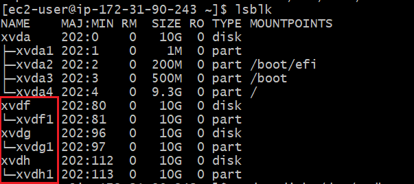
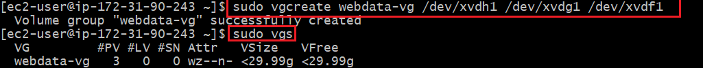
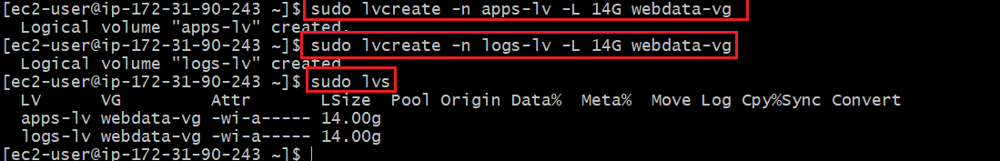
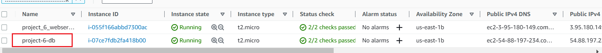

# Full-scale Web Solution using WordPress CMS and MySQL RDBMS
## Your 3-Tier Setup

1. A Laptop or PC to serve as a client
2. An EC2 Linux Server as a web server (This is where you will install WordPress)
3. An EC2 Linux server as a database (DB) server


We'll be using RedHat OS for this project
In previous projects we used ‘Ubuntu’, but it is better to be well-versed with various Linux distributions, thus, for this projects we will use very popular distribution called ‘RedHat’ (it also has a fully compatible derivative – CentOS)
Note: for Ubuntu server, when connecting to it via SSH/Putty or any other tool, we used ubuntu user, but for RedHat you will need to use ec2-user user. Connection string will look like ec2-user@<Public-IP>


## LAUNCH AN EC2 INSTANCE THAT WILL SERVE AS “WEB SERVER”.

## Step 1 — Prepare a Web Server

1. Launch an EC2 instance that will serve as "Web Server". Create 3 volumes in the same AZ as your Web Server EC2, each of 10 GiB.
Learn How to Add EBS Volume to an EC2 instance [here](https://www.youtube.com/watch?v=HPXnXkBzIHw)


- Create 10gb 3 times in the same avalibilty zone as our instance**:


- Now we attach all volumes created to our instance 


2. Connect via ssh into your terminal to begin configuration


3. Use `lsblk` command to inspect what block devices are attached to the server. Notice names of your newly created devices. All devices in Linux reside in /dev/ directory. Inspect it with `ls /dev/` and make sure you see all 3 newly created block devices there – their names will likely be xvdf, xvdh, xvdg.

- `lsbk`


- `ls /dev/`


4. Use gdisk utility to create a single partition on each of the 3 disks

`sudo gdisk /dev/xvdf`

- when promted for an input:
`n` press enter button 4 times for defualt settings
`p` press enter 
`w` press enter
`yes` press enter
respectively


- now repeat the above steps for **xvdg and xvdh**

5. Use `lsblk` utility to view the newly configured partition on each of the 3 disks.




6. Install lvm2 package using `sudo yum install lvm2`. Run `sudo lvmdiskscan` command to check for available partitions

- Use pvcreate utility to mark each of 3 disks as physical volumes (PVs) to be used by LVM
`sudo pvcreate /dev/xvdf1`
`sudo pvcreate /dev/xvdg1`
`sudo pvcreate /dev/xvdh1`
Verify that your Physical volume has been created successfully by running  :
`sudo pvs`


7. Use vgcreate utility to add all 3 PVs to a volume group (VG). Name the VG webdata-vg:
 
`sudo vgcreate webdata-vg /dev/xvdh1 /dev/xvdg1 /dev/xvdf1`
 
Verify that your VG has been created successfully by running:
`sudo vgs`



8. Use lvcreate utility to create 2 logical volumes. apps-lv (Use half of the PV size), and logs-lv Use the remaining space of the PV size. NOTE: apps-lv will be used to store data for the Website while, logs-lv will be used to store data for logs.
 
`sudo lvcreate -n apps-lv -L 14G webdata-vg`
`sudo lvcreate -n logs-lv -L 14G webdata-vg`
 
Verify that your Logical Volume has been created successfully by running:

`sudo lvs`



9. Verify the entire setup
 
`sudo vgdisplay -v #view complete setup - VG, PV, and LV`

`sudo lsblk`


10. Use mkfs.ext4 to format the logical volumes with ext4 filesystem
 
`sudo mkfs -t ext4 /dev/webdata-vg/apps-lv`

`sudo mkfs -t ext4 /dev/webdata-vg/logs-lv`


 
11. Create /var/www/html directory to store website files
 
`sudo mkdir -p /var/www/html`
 
12. Create /home/recovery/logs to store backup of log data
 
`sudo mkdir -p /home/recovery/logs`
13. Mount /var/www/html on apps-lv logical volume
 
`sudo mount /dev/webdata-vg/apps-lv /var/www/html/`

14. Use rsync utility to back up all the files in the log directory /var/log into /home/recovery/logs (This is required before mounting the file system)
 
`sudo rsync -av /var/log/. /home/recovery/logs/`

15. Mount /var/log on logs-lv logical volume. (Note that all the existing data on /var/log will be deleted.

`sudo mount /dev/webdata-vg/logs-lv /var/log`
 
16. Restore log files back into /var/log directory
 
`sudo rsync -av /home/recovery/logs/. /var/log`
 
17. Update /etc/fstab file so that the mount configuration will persist after restart of the server.

`sudo blkid`


18. Update /etc/fstab in this format using your own UUID and rememeber to remove the leading and ending quotes:

`sudo vi /etc/fstab`


edit press i
to exit press esc and type :wq

19. Test the configuration and reload the daemon
 
`sudo mount -a`
`sudo systemctl daemon-reload`
 
20. Verify your setup by running df -h, output must look like this:


## Step 2 — Prepare a Database Server 
Launch a second RedHat EC2 instance that will have a role – ‘DB Server’
Repeat the same steps as for the Web Server, but instead of `apps-lv` create `db-lv` and mount it to `/db` directory instead of `/var/www/html/`.

- launch a RedHat EC2 instance that will have a role – ‘DB Server’


- Create volumes and attach them like we did earlier


- ssh into your DB instance let's get the show on the road

- `lsbk`

- `ls /dev/`


- Use gdisk utility to create a single partition on each of the 3 disks

`sudo gdisk /dev/xvdf`


- when promted for an input:
`n` press enter button 4 times for defualt settings
`p` press enter 
`w` press enter
`yes` press enter
respectively

- now repeat the above steps for **xvdg and xvdh**


- Use `lsblk` utility to view the newly configured partition on each of the 3 disks.


- Install lvm2 package using sudo yum install lvm2. Run sudo lvmdiskscan command to check for available partitions.


- Use pvcreate utility to mark each of 3 disks as physical volumes (PVs) to be used by LVM

```
sudo pvcreate /dev/xvdf1
sudo pvcreate /dev/xvdg1
sudo pvcreate /dev/xvdh1
```

Verify that your Physical volume has been created successfully by running:

`sudo pvs`


- Use vgcreate utility to add all 3 PVs to a volume group (VG). Name the VG db-vg
 
`sudo vgcreate db-vg /dev/xvdh1 /dev/xvdg1 /dev/xvdf1`
 
Verify that your VG has been created successfully by running:

`sudo vgs`


- Use lvcreate utility to create 1 logical volumes. db-lv (we'll use 25G)
 
`sudo lvcreate -n db-lv -L 25G db-vg`

- Verify that your Logical Volume has been created successfully by running:

`sudo lvs`


-  Verify the entire setup
 
`sudo vgdisplay -v #view complete setup - VG, PV, and LV`

`sudo lsblk`


- Use mkfs.ext4 to format the logical volumes with ext4 filesystem
 
`sudo mkfs -t ext4 /dev/db-vg/db-lv`


- Create a /db directory and mount it:

`sudo mkdir /db`

`sudo mount /dev/db-vg/db-lv /db`

`df -h`


`sudo blkid`


`sudo vi /etc/fstab`


## Step 3 — Install WordPress on your Web Server EC2

- Update the repository
 
`sudo yum -y update`
 
- Install wget, Apache and it’s dependencies
 
`sudo yum -y install wget httpd php php-mysqlnd php-fpm php-json`
 
- Start Apache

    sudo systemctl enable httpd
    sudo systemctl start httpd

- To install PHP and its dependencies

```
sudo yum install https://dl.fedoraproject.org/pub/epel/epel-release-latest-8.noarch.rpm
sudo yum install yum-utils http://rpms.remirepo.net/enterprise/remi-release-8.rpm
sudo yum module list php
sudo yum module reset php
sudo yum module enable php:remi-7.4
sudo yum install php php-opcache php-gd php-curl php-mysqlnd
sudo systemctl start php-fpm
sudo systemctl enable php-fpm
setsebool -P httpd_execmem 1
```

- Restart Apache

`sudo systemctl restart httpd`
 
- Download wordpress and copy wordpress to var/www/html

 ```
mkdir wordpress
cd   wordpress
sudo wget http://wordpress.org/latest.tar.gz
sudo tar xzvf latest.tar.gz
sudo rm -rf latest.tar.gz
sudo cp wordpress/wp-config-sample.php wordpress/wp-config.php
sudo cp -R wordpress /var/www/html/
 ```

- Configure SELinux Policies
 ```
sudo chown -R apache:apache /var/www/html/wordpress
sudo chcon -t httpd_sys_rw_content_t /var/www/html/wordpress -R
sudo setsebool -P httpd_can_network_connect=1
sudo setsebool -P httpd_can_network_connect_db 1
```

## Step 4 — Install MySQL on your DB Server

`sudo yum update`
`sudo yum install mysql-server`

- Verify that the service is up and running by using `sudo systemctl status mysqld`, if it is not running, restart the service and enable it so it will be running even after reboot:
```
sudo systemctl restart mysqld
sudo systemctl enable mysqld
```
- In the database server terminal 
  we'll do mysql secure installation

`sudo mysql_secure_installation`

enter n 
yes and enter till the end


## Step 5 — Configure DB to work with WordPress

`sudo mysql`
```
CREATE DATABASE wordpress;
CREATE USER 'myuser'@'<Web-Server-Private-IP-Address>' IDENTIFIED BY 'put your password';
GRANT ALL ON wordpress.* TO 'myuser'@'<Web-Server-Private-IP-Address>';
FLUSH PRIVILEGES;
SHOW DATABASES;
exit
```
- Edit the bind address:

`sudo vi /etc/my.cnf`

        [webserver]
        bind-address=<your webserver private ip address>


## ## Step 6 — Install MySQL on your Web Server

`sudo yum update`
`sudo yum install mysql-server`

- Verify that the service is up and running by using `sudo systemctl status mysqld`, if it is not running, restart the service and enable it so it will be running even after reboot:

`sudo systemctl restart mysqld`
`sudo systemctl enable mysqld`

- Lets test that you can connect from your Web Server to your DB server by using mysql-client

   `sudo mysql -u <your db user name> -p -h <DB-Server-Private-IP-address>`

Verify if you can successfully execute `SHOW DATABASES;` command and see a list of existing databases.


- locate and edit the wp-config.php

`cd /var/www/html/wordpress/`
`ls -l`
`sudo vi wp-config.php`


- To disable the default apache homepage

`sudo mv /etc/httpd/conf.d/welcome.conf /etc/httpd/conf.d/welcome.conf_backup`


`sudo systemctl restart httpd`
`sudo systemctl status httpd`

## Step 7 — Configure WordPress to connect to the remote database.

- Do not forget to open MySQL port 3306 on DB Server EC2. For extra security, you shall allow access to the DB server ONLY from your Web Server’s IP address, so in the Inbound Rule configuration specify source as /32


- Enable TCP port 80 in Inbound Rules configuration for your Web Server EC2 (enable from everywhere 0.0.0.0/0 or from your workstation’s IP)


- Try to access from your browser the link to your WordPress:

        http://<Web-Server-Public-IP-Address>/wordpress/

- Fill out your DB credentials:


**If you see this message – it means your WordPress has successfully connected to your remote MySQL database**


Important: Do not forget to STOP your EC2 instances after completion of the project to avoid extra costs.

You have learned how to configure Linux storage susbystem and have also deployed a full-scale Web Solution using WordPress CMS and MySQL RDBMS!

# CONGRATULATIONS!


