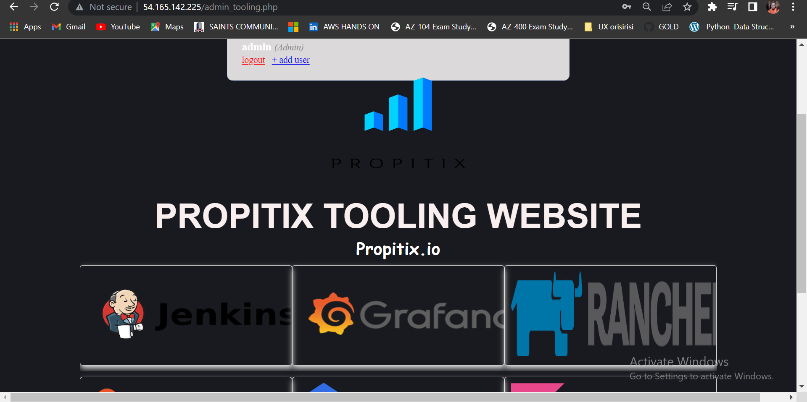

## LAMP stack with remote Database and NFS servers.

In this project you will implement a solution that consists of following components:
Infrastructre AWS
Webserver Linux: Red Hat Enterprise Linux 8
Database Server: Ubuntu 20.04 + MySQL
Storage Server: Red Hat Enterprise Linux 8 + NFS Server
Programming Language: PHP
Code Repository: [GitHub](https://github.com/darey-io/tooling.git)


On the diagram below you can see a common pattern where several stateless Web Servers share a common database and also access the same files using Network File Sytem (NFS) as a shared file storage. Even though the NFS server might be located on a completely separate hardware – for Web Servers it look like a local file system from where they can serve the same files.


It is important to know what storage solution is suitable for what use cases, for this – you need to answer the following questions: 

- what data will be stored? 
- In what format? 
- How this data will be accessed?
- By whom?
- From where?
- How frequently?
 Based on this you will be able to choose the right storage system for your solution.


## Step 1 – Prepare NFS Server
- Spin up a new EC2 instance with RHEL Linux 8 Operating System.
- Launch the instance and attach 3 volumes to it.


- ssh to the instance and let's begin to configure our nfs server 


    `sudo gdisk /dev/xvdf`
    type `n` then hit enter 5 times
    type `p` hit enter once
    type `w` hit enter once
    type `y` hit enter once


    `sudo gdisk /dev/xvdg`
    type `n` then hit enter 5 times
    type `p` hit enter once
    type `w` hit enter once
    type `y` hit enter once

    `sudo gdisk /dev/xvdh`
    type `n` then hit enter 5 times
    type `p` hit enter once
    type `w` hit enter once
    type `y` hit enter once


- Use `lsblk` utility to view the newly configured partition on each of the 3 disks

- Install lvm2 package using:

`sudo yum install lvm2`

- To check for available partitions:

`sudo lvmdiskscan`

- Use pvcreate utility to mark each of 3 disks as physical volumes (PVs) to be used by LVM:

```
sudo pvcreate /dev/xvdf1
sudo pvcreate /dev/xvdg1
sudo pvcreate /dev/xvdh1
```
- Verify that your Physical volume has been created successfully by running:

`sudo pvs`

- Use vgcreate utility to add all 3 PVs to a volume group (VG). Name the VG webdata-vg or anything you want :
 
`sudo vgcreate webdata-vg /dev/xvdh1 /dev/xvdg1 /dev/xvdf1`

- Verify that your VG has been created successfully by running:

`sudo vgs`

- Use lvcreate utility to create 3 logical volumes. apps-lv, logs-lv and opt-lv:

```
sudo lvcreate -n apps-lv -L 7G webdata-vg
sudo lvcreate -n logs-lv -L 7G webdata-vg
sudo lvcreate -n opt-lv -L 7G webdata-vg
```

- Verify that your Logical Volume has been created successfully by running:

`sudo lvs`

- Verify the entire setup
 
`sudo vgdisplay -v #view complete setup - VG, PV, and LV`

`sudo lsblk`

- Instead of formatting the disks as ext4, you will have to format them as xfs

```
sudo mkfs -t xfs /dev/webdata-vg/apps-lv
sudo mkfs -t xfs /dev/webdata-vg/logs-lv
sudo mkfs -t xfs /dev/webdata-vg/opt-lv
```

- Create mount points on /mnt directory for the logical volumes as follow:
  Mount lv-apps on /mnt/apps – To be used by webservers
  Mount lv-logs on /mnt/logs – To be used by webserver logs
  Mount lv-opt on /mnt/opt – To be used by Jenkins server in Project 8


```
sudo mkdir -p /mnt/apps
sudo mkdir -p /mnt/logs
sudo mkdir -p /mnt/opt

sudo mount /dev/webdata-vg/apps-lv /mnt/apps
sudo mount /dev/webdata-vg/logs-lv /mnt/logs
sudo mount /dev/webdata-vg/opt-lv /mnt/opt
```

- Update /etc/fstab in this format using your own UUID and rememeber to remove the leading and ending quotes.


- Test the configuration and reload the daemon
 ```
 sudo mount -a
 sudo systemctl daemon-reload
 ```
Verify your setup by running df -h, output must look like this:


- Install NFS server, configure it to start on reboot and make sure it is up and running:
```
sudo yum -y update
sudo yum install nfs-utils -y
sudo systemctl start nfs-server.service
sudo systemctl enable nfs-server.service
sudo systemctl status nfs-server.service
```

- Export the mounts for webservers’ subnet CIDR to connect as clients. For simplicity, you will install all three Web Servers inside the same subnet, but in the production set-up, you would probably want to separate each tier inside its own subnet for a higher level of security.

- Make sure we set up permission that will allow our Web servers to read, write and execute files on NFS:
```
sudo chown -R nobody: /mnt/apps
sudo chown -R nobody: /mnt/logs
sudo chown -R nobody: /mnt/opt
 
sudo chmod -R 777 /mnt/apps
sudo chmod -R 777 /mnt/logs
sudo chmod -R 777 /mnt/opt
 
sudo systemctl restart nfs-server.service
```
- Configure access to NFS for clients within the same subnet (example of Subnet CIDR – 172.31.32.0/20 ):
```
sudo vi /etc/exports
 
/mnt/apps <Subnet-CIDR>(rw,sync,no_all_squash,no_root_squash)
/mnt/logs <Subnet-CIDR>(rw,sync,no_all_squash,no_root_squash)
/mnt/opt <Subnet-CIDR>(rw,sync,no_all_squash,no_root_squash)
 
Esc + :wq!
 
sudo exportfs -arv
```

- Check which port is used by NFS and open it using Security Groups (add new Inbound Rule)
`rpcinfo -p | grep nfs`


- Important note: In order for NFS server to be accessible from your client, you must also open following ports: TCP 111, UDP 111, UDP 2049:


## STEP 2 CONFIGURE THE DATABASE SERVER

- launch an Ubuntu 20.04

- Install MySQL server
```
sudo apt -y update
sudo apt install -y mysql
```
- Create a database and name it tooling

`sudo mysql`
`create database tooling;`

- Create a database user and name it webaccess

`create user 'webaccess'@'172.31.80.0/20' identified by 'password';`

- Grant permission to webaccess user on tooling database to do anything only from the webservers subnet cidr: 

`grant all privileges on tooling.* to 'webaccess'@'172.31.80.0/20';`


## STEP 3 Prepare the Web Servers

1. Launch a new EC2 instance with RHEL 9 Operating System

2. Install NFS client

`sudo yum install nfs-utils nfs4-acl-tools -y`


3. Mount /var/www/ and target the NFS server’s export for apps
```
sudo mkdir /var/www
sudo mount -t nfs -o rw,nosuid <NFS-Server-Private-IP-Address>:/mnt/apps /var/www
```
4. Verify that NFS was mounted successfully by running `df -h`. Make sure that the changes will persist on Web Server after reboot:


`sudo vi /etc/fstab`

- add following line :

`<NFS-Server-Private-IP-Address>:/mnt/apps /var/www nfs defaults 0 0`

5. Install Remi’s repository, Apache and PHP
```
sudo yum install httpd -y
 
sudo dnf install https://dl.fedoraproject.org/pub/epel/epel-release-latest-8.noarch.rpm
 
sudo dnf install dnf-utils http://rpms.remirepo.net/enterprise/remi-release-8.rpm
 
sudo dnf module reset php
 
sudo dnf module enable php:remi-7.4
 
sudo dnf install php php-opcache php-gd php-curl php-mysqlnd
 
sudo systemctl start php-fpm
 
sudo systemctl enable php-fpm
 
sudo setsebool -P httpd_execmem 1
```
6. Verify that Apache files and directories are available on the Web Server in /var/www and also on the NFS server in /mnt/apps. If you see the same files – it means NFS is mounted correctly. You can try to create a new file touch test.txt from one server and check if the same file is accessible from other Web Servers.


also in the /mnt/apps


7. Locate the log folder for Apache on the Web Server and mount it to NFS server’s export for logs. Repeat step №4 to make sure the mount point will persist after reboot.

`sudo vi /etc/fstab`

- add following line :

`<NFS-Server-Private-IP-Address>:/mnt/logs /var/log/httpd nfs defaults 0 0`


8. Fork the tooling source code from [Darey.io](https://github.com/darey-io/tooling.git) Github Account to your Github account. (Learn how to fork a repo [here](https://youtu.be/f5grYMXbAV0))
9. Deploy the tooling website’s code to the Webserver. Ensure that the html folder from the repository is deployed to /var/www/html


Note 1: Do not forget to open TCP port 80 on the Web Server.

Note 2: If you encounter 403 Error – check permissions to your /var/www/html folder and also disable SELinux sudo setenforce 0
To make this change permanent – open following config file:

`sudo vi /etc/sysconfig/selinux`

- set SELINUX=disabled then restart httpd"

 `sudo systemctl restart httpd`


10. Update the website’s configuration to connect to the database (in /var/www/html/functions.php file). Apply tooling-db.sql script to your database using this command:

`mysql -h <databse-private-ip> -u <db-username> -p <db-pasword> < tooling-db.sql`


11. Create in MySQL a new admin user with username: myuser and password: password:


```
INSERT INTO 'users' ('id', 'username', 'password', 'email', 'user_type', 'status') VALUES
-> (1, 'myuser', '5f4dcc3b5aa765d61d8327deb882cf99', 'user@mail.com', 'admin', '1');
```

12. Open the website in your browser `http://<Web-Server-Public-IP-Address-or-Public-DNS-Name>/index.php` and make sure you can login into the website with admin admin.





We are up and running. 