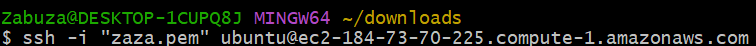

# WEB STACK IMPLEMENTATION (LAMP STACK) IN AWS
## LAMP (Linux, Apache, MySQL, PHP or Python, or Perl)
### Setup our instance
- We need an AWS account 
- launch a new EC2 instance of t2.micro family with Ubuntu Server 20.04 LTS
- Private key (.PEM file) should be saved securely and spin up the instance

- Connecting to EC2 terminal
  - Using the terminal on MAC/Linux
  - Using Windows Terminal
  - We'll be connecting to the EC2 instance using Gitbash terminal installed in my windows system

    - We'll be needing our saved PEM key file change directory to download folder

    

    - Run this command to ensure your key is not publicly viewable.
    `chmod 400 <your-PEM-file-name>.pem`

    

    - I'll be using the ssh protocol to connect my local terminal to my EC2 server
    `ssh -i <private-key-name>. pem ubuntu@<Public-IP-address>`

      

    - Type `yes` to connect

      

    - Now we are connected to our instance well done🎉.
    

We have created our first Linux Server in the Cloud and our set up looks like this now: (we are the client)

### STEP1
#### Installing Apache and updating the firewall

Update a list of packages in package manager

`sudo apt update`

Run apache2 package installation

`sudo apt install apache2`

To verify that apache2 is running as a Service in our OS, use following command

`sudo systemctl status apache2`

If it is green and running, then you did everything correctly – you have just launched your first Web Server in the Clouds!

  
